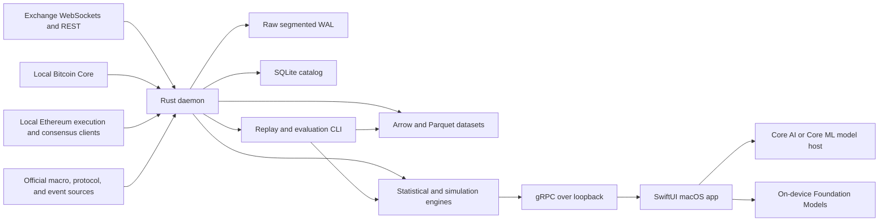

# Local-First Crypto Market Transition Intelligence Platform
## Production Architecture and Product Specification v1.0

**Status:** Approved implementation baseline
**Document date:** 2026-07-24
**Approval recorded:** 2026-07-24
**Intended release model:** Open source, local-first, research and alerting product
**Primary implementation languages:** Rust and Swift
**Primary target:** Apple Silicon Mac
**Working product description:** A probabilistic market-transition, instability, and contagion observatory for crypto assets

---

## 1. Document purpose and normative language

This document defines the product, system architecture, data contracts, model requirements, quality controls, security model, validation methodology, user interface, release gates, and open-source structure for a production-grade crypto market transition intelligence platform.

The words **MUST**, **MUST NOT**, **SHOULD**, **SHOULD NOT**, and **MAY** are normative:

- **MUST / MUST NOT** indicate a release-blocking requirement.
- **SHOULD / SHOULD NOT** indicate a strong default that can be changed only through a documented architecture decision.
- **MAY** indicates an optional capability.

This is not an automated trading specification. It is a specification for data capture, research, probabilistic forecasting, scenario analysis, alerting, and auditable decision support.

---

## 2. Executive decision

### 2.1 Product statement

The product estimates the conditional probability, direction, mechanism, severity, and likely time horizon of abrupt crypto-market transitions. It does not claim to know the exact future price or exact crash time.

A valid product output is:

> BTC downside-transition probability is 31% within four hours, compared with a calibrated 9% base rate. Structural metastability is elevated, cross-venue depth is declining, leverage is crowded, and the estimated cusp barrier is falling. Input quality is healthy and model confidence is moderate.

An invalid output is:

> Bitcoin will crash at 14:30.

### 2.2 Architecture decision

The platform SHALL use a **local modular monolith** for the first production release:

- One Rust daemon owns capture, normalization, books, features, statistical models, calibration, simulation, storage, replay, and audit state.
- One native SwiftUI macOS application owns visualization, user workflows, alerts, process supervision, and local language-model features.
- A versioned gRPC/Protocol Buffers contract connects the Swift application and Rust daemon over loopback.
- Optional on-device neural inference runs through a Swift model-host abstraction with Core AI on macOS 27+ and Core ML as the stable fallback.
- No numerical probability may be authored or modified by a language model.

This structure is preferred over microservices because it preserves deterministic replay, avoids distributed-system failure modes, is easy to install locally, and still permits future process separation at existing module boundaries.

### 2.3 Chosen production framework

| Layer | Chosen framework | Baseline policy | Reason |
|---|---|---:|---|
| Rust toolchain | Rust stable, edition 2024 | Pin 1.97.1 initially; MSRV 1.88 | Current stable toolchain, memory safety, performance, reproducible builds |
| Async runtime | Tokio 1.51 LTS line | Pin the latest tested `~1.51` patch initially | Mature nonblocking runtime; the project recommends an LTS line when fixing a minor version |
| Service middleware | Tower | Match Tokio/Tonic lockfile | Shared timeout, retry, load-shed, tracing, and auth abstractions |
| Local RPC | Tonic 0.14.x + Prost | Pin the latest tested 0.14.x patch; do not track the breaking main branch | Type-safe streaming contract interoperable with Swift |
| Swift RPC | gRPC Swift 2 + SwiftProtobuf | Pin a tested 2.x release | Native Swift concurrency and bidirectional streaming |
| Swift language/UI | Swift 6.3 strict concurrency, SwiftUI, Observation, Swift Charts | Pin Xcode/toolchain in CI | Native, accessible, low-overhead macOS experience |
| In-memory analytics | Apache Arrow | Pin Arrow/Parquet together | Columnar, strongly typed, cross-language-compatible batches |
| Durable analytical files | Apache Parquet with Zstandard | Schema-versioned | Compact immutable storage and predicate pushdown |
| Embedded analytics | Apache DataFusion | Pin compatible Arrow line | Rust-native SQL/DataFrame queries over Arrow and Parquet |
| Metadata database | SQLite in WAL mode | Bundle 3.53.3; hard floor 3.51.3 | Reliable embedded catalog; patched against the 2026 WAL-reset issue |
| Stable Apple ML | Core ML | Default GA fallback | Mature on-device inference across supported Apple hardware |
| New Apple ML | Core AI | Capability-gated on macOS 27+ | On-device specialization, stateful execution, CPU/GPU/Neural Engine support |
| Local language model | Foundation Models `SystemLanguageModel` only | Runtime availability checks | Structured extraction and explanations without cloud routing |
| Logging/telemetry | `tracing` + local metrics registry | No remote exporter by default | Structured diagnostics while preserving local-only guarantees |

### 2.4 Explicitly rejected foundations

The following SHALL NOT be foundational in v1:

- Kafka, Pulsar, or a distributed event bus.
- Kubernetes or cloud-only orchestration.
- Electron or a browser-wrapper desktop client.
- Python in the production capture or online inference path.
- CCXT or another generic library as the authoritative live-feed normalizer.
- A single opaque transformer or language model as the forecasting engine.
- Full-depth capture for every listed token on every venue.
- Automated trade execution.
- A single undifferentiated “AI score.”

Python MAY be used in isolated research notebooks or conversion tooling, but every production feature and model MUST have an equivalent deterministic implementation or validated artifact used by the production runtime.

---

## 3. Product principles

1. **Probabilities, not prophecy.** Every forecast is a calibrated probability distribution with a baseline, horizon, uncertainty, and data-quality state.
2. **Mechanism-aware.** The product separates structural metastability, leverage crowding, liquidity failure, volatility expansion, liquidations, stablecoin dislocation, and contagion.
3. **Point-in-time correct.** Historical outputs are reconstructed only from information that was available at the prediction timestamp.
4. **Local-first.** Storage, feature computation, model inference, model explanations, and user history remain on the user’s hardware by default.
5. **Evidence before explanation.** Explanations are generated from a signed evidence bundle; they cannot invent probabilities or causes.
6. **Data quality is a model input.** Missing, delayed, stale, sampled, revised, or inconsistent data are represented explicitly and can force abstention.
7. **Replay is a first-class product.** The same code path processes live events and historical replays.
8. **Simple models earn complexity.** New models ship only when they improve calibrated out-of-sample performance over strong baselines.
9. **No silent degradation.** Sequence gaps, checksum failures, stale features, unsupported schema changes, and model incompatibilities are visible and auditable.
10. **Open-source by design.** Interfaces, fixtures, model cards, tests, and release provenance are part of the public product.

---

## 4. Goals, non-goals, and users

### 4.1 Primary goals

The system MUST:

- Continuously ingest and normalize public market data from selected major venues.
- Maintain trustworthy local order books with venue-specific recovery semantics.
- Produce multi-horizon probabilities for defined market-transition events.
- Estimate stochastic cusp state, fold proximity, potential barriers, equilibrium branches, and uncertainty.
- Combine cusp-derived evidence with volatility, regime, changepoint, microstructure, derivatives, options, on-chain, event, and contagion evidence.
- Support deterministic historical replay and walk-forward model evaluation.
- Expose a native macOS screener, asset detail view, alerts, evidence, and model audit trail.
- Abstain when data or model reliability is insufficient.

### 4.2 Non-goals for v1

The system MUST NOT:

- Place, cancel, or manage exchange orders.
- Hold trading or withdrawal credentials.
- Market itself as guaranteed financial advice.
- Predict exact prices as the primary product output.
- Redistribute exchange data unless the applicable data license permits it.
- Depend on a hosted inference service.
- Support mobile capture or training.
- Promise full global exchange coverage in the first release.

### 4.3 Primary user roles

| Role | Main need |
|---|---|
| Quantitative researcher | Reproducible event data, features, labels, models, walk-forward tests, and ablations |
| Risk-focused trader | Calibrated transition probabilities, mechanisms, alert rules, and scenario ranges |
| Market-structure analyst | Cross-venue books, depth, flow, liquidation, basis, and venue-health evidence |
| Protocol/on-chain analyst | Network activity, stablecoin flows, bridge activity, and fundamental controls |
| Maintainer | Connector certification, schema migration, reliability, security, and release tooling |

---

## 5. Release scope

### 5.1 Production v1 scope

**Assets**

- BTC
- ETH
- SOL
- USDT and USDC dislocation monitoring

**Venues**

- Binance spot and USD-margined derivatives
- Bybit spot and linear derivatives
- Kraken spot and derivatives
- Deribit futures, perpetuals, and BTC/ETH options

**Forecast horizons**

- 15 minutes
- 1 hour
- 4 hours
- 24 hours

**Primary event classes**

- Downside transition
- Upside squeeze
- Volatility explosion
- Liquidity vacuum
- Liquidation cascade

**Secondary outputs**

- Market regime
- Structural cusp state
- Cross-asset contagion state
- Stablecoin dislocation state
- Scenario distributions
- Data quality and abstention state

### 5.2 Planned connector expansion

The connector interface SHALL support later adapters for Coinbase, OKX, Hyperliquid, and other venues without changing canonical downstream schemas. A venue SHALL not be promoted to production coverage until it passes the connector certification suite defined in this document.

### 5.3 Platform support

- The primary desktop release MUST support Apple Silicon Macs.
- The production UI baseline SHOULD be macOS 26 or later.
- Core AI features MUST be optional until macOS 27 and its Core AI APIs are final and pass release validation.
- A Core ML fallback MUST preserve every critical forecast function when Core AI is unavailable.
- Linux MAY be supported for the headless Rust daemon and research/replay tools.
- Intel Mac support is out of scope for v1.

---

## 6. Forecast contract

### 6.1 Forecast object

Every published forecast MUST contain:

```text
forecast_id
asset_id
as_of_event_time
as_of_receive_time
model_bundle_id
feature_set_id
label_definition_id
event_type
horizon
conditional_probability
calibrated_base_rate
probability_interval
severity_distribution
expected_time_to_event_distribution
market_regime
structural_state
mechanism_contributions
data_quality_state
model_confidence_state
out_of_distribution_score
abstention_reason
source_freshness_summary
```

### 6.2 Time-to-event definition

For a downside threshold of magnitude `k`, the first-passage time is:

\[
\tau^-_{k,t}=\inf\left\{u>0:\log(P_{t+u}/P_t)\le -k\right\}.
\]

The system estimates:

\[
\Pr(\tau^-_{k,t}\le h\mid X_t)
\]

for each supported horizon `h`.

The platform MUST expose cumulative probabilities that are monotonic in horizon. It SHALL derive them from discrete interval hazards rather than fitting unrelated binary classifiers for each horizon.

### 6.3 Probability precision

- User-facing probabilities MUST use no more than one decimal percentage point unless the sample size and calibration support greater precision.
- Internal calculations MAY retain full floating-point precision.
- A probability MUST NOT be shown without its horizon and event definition.
- A probability MUST NOT be shown when the applicable model has abstained.

### 6.4 Confidence terminology

The UI SHALL distinguish:

- **Aleatoric uncertainty:** irreducible market randomness represented by the predictive distribution.
- **Epistemic uncertainty:** uncertainty from model parameters, limited examples, or distribution shift.
- **Data uncertainty:** missing, stale, sampled, delayed, inconsistent, or revised inputs.

The generic word “confidence” MAY be used only as a summary of those documented components.

---

## 7. System context and architecture

### 7.1 Context diagram



### 7.2 Internal planes

The Rust daemon SHALL be organized into five logical planes:

1. **Capture plane** — venue adapters, node adapters, raw WAL, clocks, and source health.
2. **State plane** — canonical normalization, instrument registry, order books, consolidated market state, watermarks, and quality.
3. **Feature plane** — streaming and batch-identical features, labels, and point-in-time views.
4. **Model plane** — volatility, cusp, regime, changepoint, hazard, calibration, contagion, and scenario engines.
5. **Audit plane** — model registry, prediction ledger, alerts, replay manifests, configuration, metrics, and provenance.

### 7.3 Process topology

Default interactive mode:

```text
Cusp Observatory.app
  ├── SwiftUI process
  ├── optional Swift model-host process
  └── child process: cryptoriskd
```

Continuous-capture mode:

```text
launchd user LaunchAgent
  └── cryptoriskd

Cusp Observatory.app
  └── connects to existing authenticated local daemon
```

The product MUST use a user-level LaunchAgent through `SMAppService` when continuous capture is enabled. It MUST NOT install a root LaunchDaemon in v1.

### 7.4 Concurrency model

The Rust daemon SHALL use explicit Tokio tasks and bounded channels, not an external actor framework.

- Each exchange connection runs in an isolated supervised task.
- Parsing and normalization are separated from socket reads by bounded queues.
- Each order-book shard has a single writer.
- Instruments are assigned to shards using a stable hash.
- CPU-heavy feature/model work uses a bounded compute pool.
- Storage writers use dedicated single-writer tasks per segment or partition.
- Every queue defines a capacity, overflow policy, and metric.
- No order-book delta may be silently dropped.

When capacity is exhausted:

- Critical book deltas trigger source degradation and resynchronization rather than silent sampling.
- Noncritical ticker aggregates MAY be coalesced by key.
- UI updates MAY be sampled while the underlying prediction ledger remains complete.
- Historical compaction MAY be paused.

### 7.5 Repository structure

```text
/
├── Cargo.toml
├── rust-toolchain.toml
├── Cargo.lock
├── LICENSE-APACHE
├── LICENSE-MIT
├── SECURITY.md
├── CONTRIBUTING.md
├── CODE_OF_CONDUCT.md
├── docs/
│   ├── architecture/
│   ├── model-cards/
│   ├── data-dictionary/
│   ├── adr/
│   └── operations/
├── proto/
│   ├── common/v1/
│   ├── market/v1/
│   ├── risk/v1/
│   ├── replay/v1/
│   └── admin/v1/
├── crates/
│   ├── domain/
│   ├── fixed-decimal/
│   ├── instrument-registry/
│   ├── event-envelope/
│   ├── connector-core/
│   ├── connector-binance/
│   ├── connector-bybit/
│   ├── connector-kraken/
│   ├── connector-deribit/
│   ├── chain-bitcoin/
│   ├── chain-ethereum/
│   ├── orderbook/
│   ├── raw-wal/
│   ├── parquet-store/
│   ├── metadata-store/
│   ├── feature-registry/
│   ├── feature-engine/
│   ├── labels/
│   ├── volatility/
│   ├── cusp/
│   ├── coupled-cusp/
│   ├── changepoint/
│   ├── regime/
│   ├── hazard/
│   ├── calibration/
│   ├── scenarios/
│   ├── model-registry/
│   ├── quality/
│   ├── local-api/
│   └── observability/
├── apps/
│   ├── cryptoriskd/
│   ├── crypto-replay/
│   ├── crypto-evaluate/
│   ├── connector-certify/
│   └── macos/
│       ├── CuspObservatory.xcodeproj
│       ├── App/
│       ├── ModelHost/
│       └── GeneratedProto/
├── fixtures/
│   ├── exchanges/
│   ├── corrupted-streams/
│   └── golden-replays/
├── models/
│   ├── schemas/
│   └── public-test-artifacts/
└── scripts/
    ├── generate-proto.sh
    ├── verify-reproducibility.sh
    └── package-macos.sh
```

No production crate SHOULD exceed one clear responsibility. Public crate APIs MUST be documented and versioned through semantic changes.

---

## 8. Local RPC and process security

### 8.1 Transport

- The daemon MUST bind only to `127.0.0.1` and `::1` by default.
- The port SHOULD be selected dynamically.
- Remote binding MUST be disabled in production v1.
- gRPC server reflection MUST be disabled in release builds unless the user enables developer mode.
- Every RPC except the initial health probe MUST require an authenticated session.

### 8.2 Session bootstrap

Interactive mode SHALL use this handshake:

1. Swift creates an anonymous pipe or inherited file descriptor.
2. Swift generates a cryptographically random 256-bit session secret.
3. Swift launches the daemon and passes the secret over the inherited descriptor, never in command-line arguments.
4. The daemon binds loopback, writes its selected port and process nonce through the same protected channel, and closes the descriptor.
5. Swift sends the session secret in gRPC metadata.
6. A Tower interceptor compares the secret in constant time and validates the process nonce.
7. The secret exists only in process memory and expires when either process exits.

Continuous mode MAY store a long-lived local service credential in the macOS data-protection keychain. The credential MUST be scoped to the signed app and its helper, rotatable, and revocable.

### 8.3 API compatibility

Every RPC handshake MUST exchange:

```text
api_major
api_minor
daemon_build_id
app_build_id
schema_bundle_hash
feature_capabilities
model_runtime_capabilities
minimum_compatible_version
```

- A major mismatch MUST fail closed with an actionable upgrade message.
- A minor mismatch MAY operate only when declared compatible.
- Unknown Protocol Buffer fields MUST be preserved where applicable.
- Field numbers MUST never be reused.

### 8.4 Core services

```text
HealthService
CatalogService
MarketStateService
RiskService
AlertService
ReplayService
ModelRegistryService
DataQualityService
AdminService
ModelHostService
```

Required methods include:

```text
HealthService.Check
CatalogService.ListAssets
CatalogService.ListVenues
CatalogService.GetInstrument
MarketStateService.SubscribeAssetState
MarketStateService.SubscribeVenueState
MarketStateService.GetOrderBookSnapshot
RiskService.SubscribeForecasts
RiskService.GetForecastSnapshot
RiskService.GetCuspState
RiskService.GetScenarioDistribution
RiskService.GetEvidenceBundle
AlertService.ListRules
AlertService.UpsertRule
AlertService.SubscribeAlertEvents
ReplayService.CreateReplay
ReplayService.ControlReplay
ReplayService.SubscribeReplayState
ModelRegistryService.ListModels
ModelRegistryService.GetModelCard
DataQualityService.SubscribeQuality
AdminService.GetRuntimeStatus
AdminService.ApplyConfiguration
AdminService.RequestGracefulShutdown
ModelHostService.GetCapabilities
ModelHostService.WarmModel
ModelHostService.InferBatch
```

### 8.5 Streaming semantics

Every server-streaming response MUST contain:

```text
stream_id
stream_sequence
snapshot_or_delta
as_of_time
resume_token
schema_version
```

A reconnecting client MUST request a resume token. If the token is no longer retained, the server MUST return a fresh snapshot before deltas.

---

## 9. Data-source strategy

### 9.1 Source classes

| Class | Examples | Trust treatment |
|---|---|---|
| Native exchange market data | Trades, books, marks, funding, OI, liquidations | High timeliness; venue-specific completeness and manipulation risks |
| Local blockchain nodes | Blocks, transactions, receipts, mempool | Independently verified protocol data; attribution remains derived |
| Official project/venue announcements | Listings, upgrades, maintenance, governance | High source identity; interpretation still uncertain |
| Official macro data | Rates, economic calendar, market indices where licensed | Timestamp and revision-aware |
| Third-party labels | Exchange addresses, entity clusters | Confidence, provider, version, and revision mandatory |
| Social/attention data | Search, page views, social posts | Experimental; licensing and manipulation controls mandatory |

### 9.2 Connector policy

Each venue adapter MUST use native venue documentation and preserve venue-specific semantics. Generic libraries MAY support discovery or one-off backfills but MUST NOT define the production event contract.

Each connector MUST declare a `ConnectorCapabilities` record:

```text
venue
connector_version
market_types
trade_semantics
book_depths
book_sequence_semantics
checksum_support
liquidation_completeness
funding_fields
open_interest_fields
options_fields
connection_lifetime
rate_limit_model
snapshot_method
recovery_method
source_timestamp_precision
known_limitations
terms_reference
redistribution_class
```

### 9.3 Initial venue requirements

#### Binance

The adapter MUST support:

- Spot trades, best bid/ask, and diff-depth.
- USD-margined aggregate trades, diff-depth, mark/index, funding, open interest, and liquidation snapshots.
- Official local-book snapshot-and-buffer procedure.
- Connection renewal before venue-enforced lifetime expiry.
- Current `/public`, `/market`, and `/private` routing where required by the current API.

Binance liquidation data MUST be tagged `SAMPLED_LATEST_PER_SYMBOL_WINDOW`, because the all-market stream currently publishes only the latest liquidation per symbol within each 1000-millisecond interval. It MUST NOT be treated as a complete liquidation tape.

#### Bybit

The adapter MUST support:

- Spot and linear perpetual trades.
- Snapshot-plus-delta books at configured depth.
- Reset of the local book whenever a new snapshot is received.
- Handling of update ID reset conditions such as `u = 1`.
- Mark, index, funding, OI, and the all-liquidation stream.

Bybit liquidation data SHOULD be tagged as a venue-reported all-liquidation feed with documented 500-millisecond push cadence, while retaining a general source-delivery uncertainty flag.

#### Kraken

The adapter MUST support:

- Spot trades, L2, optional L3 for selected Tier A instruments, and derivatives where available.
- Decimal-string preservation for checksum construction.
- CRC32 checksum verification for supported L2 feeds.
- L3 order identity and queue analysis only when the stream is healthy and licensed for the intended use.

#### Deribit

The adapter MUST support:

- BTC and ETH perpetuals and futures.
- Full option instrument metadata.
- Option ticker fields including implied volatility, Greeks, open interest, mark/index values, and funding where applicable.
- Option trades and selected option books for liquid expiries.

### 9.4 Connector certification

A connector MUST pass all of the following before production enablement:

1. Golden parser fixtures for every subscribed message type.
2. Unknown-field and field-reordering tests.
3. Numeric boundary tests and fixed-point round trips.
4. Snapshot/delta reconstruction test.
5. Missing, duplicated, and reordered sequence tests.
6. Checksum mismatch and forced resnapshot test where supported.
7. Connection expiry and clean-renewal test.
8. Rate-limit and backoff test.
9. Schema-drift fail-safe test.
10. Clock-skew and timestamp-unit test.
11. Burst-load and bounded-queue test.
12. Raw-WAL replay equivalence test.
13. Kill-and-restart recovery test.
14. Data-completeness metadata test.
15. Terms and redistribution review.

Certification artifacts MUST be committed or attached to the release provenance.

---

## 10. Canonical identifiers and numeric types

### 10.1 Asset identifier

An asset identifier MUST distinguish chain and contract identity:

```text
asset_namespace       // native, evm, solana, fiat, synthetic
chain_id
contract_or_mint
canonical_symbol
asset_generation
```

Symbols alone are not identifiers.

### 10.2 Instrument identifier

```text
venue
venue_symbol
product_type          // spot, perpetual, future, option
base_asset_id
quote_asset_id
settlement_asset_id
contract_multiplier
contract_value_unit
linear_or_inverse
expiry_time
strike
option_side
price_tick
quantity_step
instrument_generation
listing_time
delisting_time
```

`instrument_generation` MUST change when a venue reuses a symbol with materially different contract semantics.

### 10.3 Fixed-point decimal

Authoritative source values MUST use:

```text
FixedDecimal {
  signed_mantissa: i128
  scale: u32
}
```

Requirements:

- Parsing MUST begin from the source string or integer representation.
- Binary floating point MUST NOT be the source of truth for prices, quantities, fees, strikes, or contract multipliers.
- Conversion to `f64` is allowed only inside derived analytics with documented error tolerance.
- Overflow, scale loss, and noncanonical input MUST return explicit errors.
- Every notional conversion MUST use instrument metadata and distinguish linear from inverse contracts.

### 10.4 Event identity

- Source-native IDs MUST be retained.
- Canonical IDs SHOULD be deterministic BLAKE3 hashes over source, instrument generation, event type, source identifier or sequence, and canonical payload.
- Model runs and user-created objects MAY use UUIDv7.

---

## 11. Canonical event envelope

Every raw and normalized event MUST include:

```text
EventEnvelope {
  schema_version
  event_id
  source
  venue
  instrument_id
  event_type
  exchange_event_time_ns
  exchange_transaction_time_ns
  receive_wall_time_ns
  receive_monotonic_time_ns
  normalization_time_ns
  sequence_number
  previous_sequence_number
  connection_epoch
  subscription_epoch
  snapshot_or_delta
  source_checksum
  raw_payload_hash
  parser_version
  normalizer_version
  quality_flags
  payload
}
```

### 11.1 Required normalized payloads

```text
Trade
TopOfBook
BookSnapshot
BookDelta
InstrumentDefinition
FundingObservation
OpenInterestObservation
LiquidationObservation
MarkIndexObservation
FutureBasisObservation
OptionTicker
OptionTrade
VenueStatus
ChainBlock
ChainTransactionAggregate
ChainMempoolObservation
ChainMetric
ExternalMarketObservation
StructuredEvent
DataQualityObservation
PredictionRecord
AlertEvent
```

### 11.2 Timestamp rules

The system MUST retain separately:

- Exchange event time.
- Exchange transaction or matching-engine time when provided.
- Local wall-clock receive time.
- Local monotonic receive time.
- Normalization time.

Cross-venue event ordering MUST NOT rely solely on local receive time. Latency calculations MUST use the monotonic clock for local intervals and report estimated exchange-clock skew separately.

### 11.3 Raw payload preservation

- The exact received payload bytes MUST be stored for Tier A streams during the raw-retention window.
- Compression, framing, or transport wrappers MAY be removed only if the canonical unwrapped bytes and original transport metadata are retained.
- Parser failures MUST preserve the raw payload in a quarantine segment.

---

## 12. Order-book engine

### 12.1 State machine

```text
DISCONNECTED
  -> CONNECTING
  -> SUBSCRIBED
  -> SNAPSHOT_PENDING
  -> SYNCHRONIZING
  -> HEALTHY
  -> DEGRADED
  -> RESYNCING
  -> HEALTHY
```

Any unrecoverable error returns to `DISCONNECTED` with exponential backoff and jitter.

### 12.2 Generic recovery algorithm

1. Connect and subscribe.
2. Start buffering deltas if the venue requires an external snapshot.
3. Receive or request a snapshot.
4. Validate instrument generation and subscription epoch.
5. Align snapshot sequence to buffered deltas.
6. Apply deltas in strict venue-defined order.
7. Validate checksum where supported.
8. Publish trusted state only after synchronization.
9. On sequence gap, impossible state, checksum mismatch, or reset marker:
   - mark the book `DEGRADED` immediately;
   - stop emitting trusted book-dependent features;
   - retain the incident and raw messages;
   - discard or checkpoint invalid state according to venue semantics;
   - obtain a fresh snapshot;
   - replay valid buffered deltas;
   - return to `HEALTHY` only after validation.

### 12.3 Invariants

The book engine MUST enforce:

- Bid prices strictly descending.
- Ask prices strictly ascending.
- Best bid less than best ask unless the venue is in a documented auction or crossed state.
- No negative quantity.
- Zero quantity deletes a level where venue semantics specify that behavior.
- Fixed-point alignment to price tick and quantity step.
- Monotonic source sequence when supplied.
- No publication from a stale instrument generation.

### 12.4 Sharding

- Each book has exactly one writer.
- Readers obtain immutable snapshots or versioned views.
- Snapshot publication SHOULD use copy-on-write or compact immutable level arrays.
- The UI SHALL receive depth snapshots at a controlled cadence, not every source delta.
- Feature calculations MAY subscribe to level changes directly inside the daemon.

### 12.5 Book quality

Every book snapshot MUST include:

```text
health_state
last_source_sequence
last_update_age_ms
checksum_status
resync_count_1h
missing_sequence_count_1h
crossed_state_count_1h
source_latency_percentiles
trusted_depth_levels
quality_score_0_to_1
```

---

## 13. Consolidated market state

### 13.1 Fair price

The system SHALL compute a robust cross-venue reference price from healthy venues only.

Candidate venue prices include:

- Midprice.
- Microprice.
- Recent robust trade price.
- Venue mark or index where appropriate.

The default fair price SHOULD be a weighted median or robust M-estimator. Venue weights MAY use capped functions of depth, spread, freshness, and historical reliability. A single venue MUST NOT dominate solely because of reported volume.

### 13.2 Stablecoin-adjusted quotes

USDT-, USDC-, USD-, and other quote-denominated markets MUST NOT be treated as identical when stablecoin dislocation is material.

The normalizer SHALL maintain quote conversion factors and uncertainty:

```text
quote_to_usd_estimate
quote_to_usd_interval
source_count
freshness
stablecoin_dislocation_state
```

### 13.3 Venue inclusion rules

A venue is excluded from consolidated values when:

- Critical book state is degraded.
- Quote age exceeds the configured TTL.
- Price is an extreme outlier without cross-venue confirmation.
- Instrument metadata is stale or ambiguous.
- Venue status reports suspension, auction, or maintenance incompatible with normal trading.
- Clock or parser health falls below the minimum threshold.

Exclusion itself MUST be recorded as a feature and audit event.

---

## 14. Local blockchain data

### 14.1 Bitcoin

A local Bitcoin Core node SHOULD provide:

- Blocks and transactions.
- Chain height, validation state, and reorganization status.
- Mempool contents and sequence.
- Fee and virtual-size distributions.
- Difficulty and estimated network hash rate.
- UTXO-derived metrics where the local index supports them.

The ingestion layer MUST detect reorgs and version all affected aggregates. A block-derived feature MUST include confirmation depth and finality state.

### 14.2 Ethereum

A local Ethereum setup MUST pair an execution client with a consensus client. The ingestion layer SHOULD collect:

- Blocks, transactions, receipts, logs, gas, base fees, and priority fees.
- Burn and issuance inputs.
- Staking deposits/exits and validator queue data where available.
- Stablecoin mint, burn, and transfer events.
- DEX and bridge events from explicitly configured contracts.
- Blob usage and fees where relevant.

A normal full node is sufficient for forward collection and recent-state features. Historical-state research MAY require a separate archive node. Archive operation SHOULD be treated as a distinct deployment profile due to multi-terabyte storage requirements.

### 14.3 Attribution and labels

Entity labels such as “exchange address” are derived data, not protocol facts. Every attributed metric MUST retain:

```text
label_provider
label_dataset_version
label_confidence
first_seen_time
last_updated_time
historical_revision_time
unlabelled_share
```

A revised label MUST create a new feature dataset version. It MUST NOT silently rewrite historical live predictions.

---

## 15. Event and language-model ingestion

### 15.1 v1 source policy

V1 SHOULD prioritize official sources:

- Exchange status and listing announcements.
- Protocol release notes and security advisories.
- Governance proposals and finalized decisions.
- Network upgrade schedules.
- Token unlock schedules from authoritative sources.
- Official economic calendars and macro releases where licensing permits.

Social-media firehose ingestion is experimental and disabled by default.

### 15.2 Structured event schema

```text
StructuredEvent {
  event_id
  event_type
  affected_assets
  affected_venues
  affected_protocols
  source_identity
  source_reliability
  publication_time
  effective_time
  expected_end_time
  direction_prior
  severity_prior
  extraction_confidence
  human_verified
  source_document_hash
  extractor_model_id
  extractor_prompt_version
  extracted_facts
}
```

### 15.3 Foundation Models restrictions

The Swift application MAY use the on-device `SystemLanguageModel` for structured extraction and explanation, subject to runtime availability.

It MUST NOT:

- Use Private Cloud Compute or another server model in local-only mode.
- Assign a forecast probability.
- Change a numeric model output.
- Call network tools.
- Treat generated text as an authoritative source.
- operate without storing the prompt version, OS build, model availability state, and source-document hash.

Structured output MUST be schema-constrained and validated. A deterministic rules-based fallback MUST remain available.

---

## 16. Storage architecture

### 16.1 Storage layers

| Layer | Technology | Purpose |
|---|---|---|
| Hot state | In-memory Rust structures and Arrow batches | Live books, rolling windows, current features |
| Raw WAL | Custom framed append-only segments | Exact received bytes and crash recovery |
| Normalized events | Parquet | Durable event history |
| Features and labels | Parquet | Versioned training/replay datasets |
| Metadata and audit | SQLite | Catalog, configs, models, alerts, manifests, prediction index |
| Analytical query | DataFusion | Local SQL/DataFrame access over Parquet and Arrow |

### 16.2 Data directory

```text
~/Library/Application Support/CuspObservatory/
├── config/
├── catalog/catalog.sqlite
├── raw/<source>/<stream>/<YYYY-MM-DD>/<segment>.wal
├── raw-sealed/<source>/<stream>/<YYYY-MM-DD>/<segment>.wal.zst
├── normalized/<event_type>/<venue>/<YYYY-MM-DD>/<HH>/*.parquet
├── features/<feature_set_id>/<resolution>/<YYYY-MM-DD>/*.parquet
├── labels/<label_definition_id>/<YYYY-MM-DD>/*.parquet
├── predictions/<model_bundle_id>/<YYYY-MM-DD>/*.parquet
├── models/<model_bundle_id>/
├── replay/<replay_id>/
├── quarantine/
├── logs/
└── cache/
```

### 16.3 Raw WAL format

Each active WAL segment SHALL contain framed records:

```text
magic
format_version
header_length
flags
stream_id
connection_epoch
record_sequence
receive_wall_time_ns
receive_monotonic_time_ns
payload_length
payload_bytes
crc32c
```

Requirements:

- Active segments MUST be append-only.
- CRC32C MUST protect each frame.
- Segments SHOULD rotate at 256 MiB or five minutes, whichever occurs first.
- Rotation MUST fsync, seal a manifest, compute a BLAKE3 hash, and only then begin background compression.
- A compressed replacement MUST be verified before the uncompressed sealed segment is removed.
- Startup recovery MUST scan to the last valid frame and truncate only an incomplete tail.

Default durability profile:

- WAL flush every 250 milliseconds or 4 MiB, whichever occurs first.
- Segment metadata fsync at rotation.
- User-selectable strict mode MAY fsync every accepted batch.

The UI MUST clearly describe the corresponding maximum local capture loss after sudden power failure.

### 16.4 Parquet policy

- Arrow and Parquet crate versions MUST be pinned together.
- Zstandard compression SHOULD use a low-latency level initially.
- Row groups SHOULD target 64–128 MiB after compression profiling.
- Files MUST include schema version, feature version, code commit, source coverage, and min/max event time in metadata.
- Partitions MUST avoid excessive small files; compaction is mandatory.
- Active-hour files MAY be rewritten only before they are sealed.
- Sealed historical files are immutable; corrections create a new dataset version.

### 16.5 SQLite policy

- SQLite MUST be bundled at version 3.53.3 or later for the initial release.
- Version 3.51.3 is the absolute minimum because earlier WAL-mode releases are affected by the documented WAL-reset corruption bug.
- The application MUST use a single metadata writer task.
- Readers MAY use separate read connections.
- `journal_mode=WAL` and `synchronous=FULL` SHOULD be used for catalog/audit data.
- Checkpoints MUST be explicit and observable.
- The application MUST run `PRAGMA integrity_check` on controlled maintenance intervals and after unclean recovery.

SQLite MUST NOT store high-rate trades or books.

### 16.6 Retention tiers

| Data | Default v1 retention | Notes |
|---|---:|---|
| Tier A raw payloads | 14 days | Configurable 7–30 days |
| Tier A normalized events | 180 days hot/warm | Older data can remain in cold Parquet |
| Tier B normalized events | 90 days | Aggregates retained longer |
| Tier C ticker/metadata | Permanent aggregates | Raw not retained by default |
| One-second aggregates | Permanent | Subject to disk budget |
| One-minute and slower aggregates | Permanent | Versioned |
| Features, labels, predictions | Permanent | Required for audit and evaluation |
| Logs | 30 days | Security incidents retained separately |

A disk-budget manager MUST estimate days remaining and apply only documented retention policies. It MUST never delete model manifests, prediction audit records, or user alerts without explicit user action.

---

## 17. Coverage tiers and capacity control

### 17.1 Tier A — systemic markets

Default Tier A instruments:

- BTC and ETH spot on selected venues.
- BTC and ETH major perpetuals.
- SOL spot and perpetuals.
- Core stablecoin/USD pairs.
- Selected BTC/ETH dated futures.
- Liquid BTC/ETH option expiries and strikes.

Capture:

- Every trade.
- Full configured L2.
- Selective L3 where supported.
- Funding, OI, mark/index, basis, liquidations.
- Raw payloads during retention.

### 17.2 Tier B — liquid secondary markets

Capture:

- Trades.
- Best bid/ask.
- Shallow or sampled L2.
- Derivatives state.
- One-second normalized state.

### 17.3 Tier C — venue universe

Capture:

- Instrument metadata.
- Ticker or one-minute aggregates.
- Venue and listing status.
- Listing/delisting history.

### 17.4 Admission control

The system MUST estimate expected bandwidth, CPU, and disk before applying a coverage change. It SHOULD refuse configurations that exceed the validated capacity profile unless the user explicitly enables an experimental override.


---

## 18. Point-in-time feature engine

### 18.1 Feature engine responsibilities

The feature engine MUST turn normalized events into deterministic, versioned, quality-aware feature observations suitable for live inference, replay, training, and audit.

A feature observation is not only a numeric value. It MUST include:

```text
feature_id
feature_version
entity_id
window_id
resolution
value
value_type
event_time_start
event_time_end
as_known_at
computed_at
watermark
finality_state
source_coverage
quality_score
missingness_reason
normalization_version
formula_hash
code_commit
lineage_hash
```

`as_known_at` is the earliest timestamp at which the complete observation was available to the product. Historical prediction code MUST join on `as_known_at <= prediction_time`, not merely on the event’s economic timestamp.

### 18.2 Feature-definition contract

Every feature MUST be declared in a registry rather than created ad hoc. A definition SHALL contain:

```rust
pub struct FeatureDefinition {
    pub id: FeatureId,
    pub version: SemVer,
    pub value_type: FeatureValueType,
    pub entities: EntityScope,
    pub required_inputs: Vec<InputRequirement>,
    pub event_time_policy: EventTimePolicy,
    pub windows: Vec<WindowDefinition>,
    pub output_resolution: Duration,
    pub allowed_lateness: Duration,
    pub time_to_live: Duration,
    pub normalization: NormalizationPolicy,
    pub missingness: MissingnessPolicy,
    pub quality_gate: QualityRequirement,
    pub formula_hash: Digest,
    pub documentation: FeatureDocumentation,
}
```

The registry MUST identify whether a feature is:

- **Required:** release-blocking for at least one production model.
- **Optional:** improves coverage or accuracy but has an explicit fallback.
- **Experimental:** visible only in research mode until release gates are passed.

### 18.3 Event-time and watermarks

The engine MUST distinguish:

- **Event time:** when the source says the event occurred.
- **Receive time:** when the local collector received it.
- **As-known-at time:** when the platform had enough trustworthy information to publish the feature.
- **Computation time:** when the feature process emitted the record.

Each stream partition MUST advance an event-time watermark. A window can be:

1. `provisional` — computed before the allowed-lateness period closes;
2. `final` — all required source watermarks have passed the window;
3. `corrected` — a later source correction caused a new version;
4. `invalid` — quality requirements were not met.

Live prediction MAY use provisional features when the model declares them acceptable. Training MUST reproduce the exact provisional/final policy that was active in production.

### 18.4 Resolution families

The platform SHALL maintain three aligned resolution families:

| Family | Typical cadence | Typical windows | Purpose |
|---|---:|---|---|
| Fast | 100 ms and 1 s | 1 s–15 min | Trigger, liquidity, order flow, venue failure |
| Tactical | 1 min and 5 min | 5 min–24 h | Leverage, volatility, cross-venue, hazard models |
| Structural | 15 min, 1 h, and 1 day | 1 h–180 d | Cusp controls, on-chain, options, macro, regimes |

The 100 ms cadence is an internal state cadence, not a promise that every external venue provides complete 100 ms observations.

### 18.5 Window semantics

Windows MUST declare one of:

- tumbling;
- sliding;
- session-aligned;
- exponentially weighted;
- event-count based;
- volume or notional based.

Calendar windows MUST use UTC internally. User display MAY use Europe/Warsaw or another selected time zone. Daylight-saving changes MUST never alter model windows.

### 18.6 Normalization and leakage prevention

Normalization parameters MUST be fit only on data available before the evaluated prediction. Supported policies include:

- robust rolling median and median absolute deviation;
- expanding quantiles;
- training-fold z-score;
- logarithmic or signed-log transform;
- volatility scaling;
- asset-relative normalization;
- cross-sectional rank within a point-in-time universe;
- time-of-week seasonal adjustment;
- liquidity-bucket normalization.

Global full-history means, standard deviations, quantiles, winsorization bounds, or label-conditioned transformations MUST NOT be used in backtests.

### 18.7 Missingness

Missingness is semantically meaningful and MUST NOT default silently to zero. Each missing value SHALL carry one reason:

```text
not_listed
source_not_supported
source_disconnected
sequence_gap
stale
insufficient_history
window_not_final
below_liquidity_threshold
vendor_revision_pending
model_not_applicable
privacy_or_license_restriction
unknown
```

Models MUST either:

- consume an explicit missingness indicator;
- use a documented deterministic imputation learned on the training fold; or
- abstain.

### 18.8 Stream/batch parity

The same Rust feature implementations MUST operate on:

- live event streams;
- recorded WAL replay;
- Parquet batch replay;
- unit and golden fixtures.

For a fixed source sequence, configuration, code commit, and model package, the platform MUST reproduce bit-identical fixed-point features and numerically equivalent floating-point features within declared tolerances.

---

## 19. Production feature catalogue

### 19.1 Price and return features

Required features, calculated at multiple horizons:

- log return;
- cumulative return;
- high-low and open-close range;
- distance from rolling and anchored VWAP;
- distance from robust consolidated fair price;
- trend slope and acceleration;
- maximum drawdown and run-up;
- positive and negative semivariance;
- lagged return autocorrelation;
- variance ratio;
- rolling skewness and excess kurtosis;
- return reversal after large signed moves;
- gap relative to the previous finalized interval.

For consolidated fair price \(P_t^*\), the default estimator SHOULD be a weighted robust median of healthy venue midprices. Weights SHOULD depend on executable depth, source quality, and freshness and MUST be capped so no single venue dominates.

### 19.2 Volatility and jump features

Required:

\[
RV_{t,h}=\sum_{i\in h} r_i^2
\]

and:

- realized volatility;
- realized upside and downside semivariance;
- exponentially weighted volatility;
- Parkinson range volatility;
- Garman–Klass range volatility where OHLC is valid;
- bipower variation;
- estimated jump variation;
- volatility of volatility;
- volatility term ratios;
- intraday-seasonality-adjusted volatility;
- realized correlation and covariance;
- volatility forecast residual.

A jump proxy MAY use:

\[
J_{t,h}=\max(RV_{t,h}-BV_{t,h},0)
\]

where \(BV\) is bipower variation. The precise estimator and sampling frequency MUST be versioned.

### 19.3 Order-book features

For bid and ask depth \(B_d\) and \(A_d\) within distance \(d\) of the reference price:

\[
I_d=\frac{B_d-A_d}{B_d+A_d}.
\]

Required depth bands are 1, 2, 5, 10, 25, 50, and 100 basis points where the instrument’s tick size and liquidity support them.

Required features:

- absolute and relative spread;
- depth by side and band;
- normalized order-book imbalance by band;
- weighted midpoint and microprice;
- book slope and convexity;
- distance to the next material liquidity wall;
- price-level gap density;
- expected sweep cost for configurable USD notionals;
- maximum executable notional within a slippage limit;
- quote age and stale-side duration;
- number of active price levels;
- local book entropy;
- depth concentration by level;
- change in depth and spread;
- post-trade replenishment and resiliency.

A top-level microprice MAY be defined as:

\[
P_{\mu}=\frac{P_a Q_b + P_b Q_a}{Q_b+Q_a}.
\]

The implementation MUST handle zero quantity and locked/crossed books explicitly.

### 19.4 Order-flow features

Required:

- aggressive buy and sell count, quantity, and notional;
- signed trade imbalance;
- order-flow imbalance;
- cancellation, placement, and modification rate;
- cancellation-to-trade and quote-to-trade ratios;
- trade intensity and inter-arrival dispersion;
- signed volume at price;
- price impact after fixed notional or signed-volume shocks;
- adverse-selection proxy;
- recovery time after a large trade;
- book half-life;
- repeated sweeping direction;
- clustered large-trade activity.

Where aggressor side is not supplied reliably, it MUST be inferred with a versioned venue-specific rule and an `inferred` flag.

L3-only experimental features:

- queue position pressure;
- order lifetime distribution;
- cancel/replace patterns;
- queue depletion probability;
- participant-level concentration only where lawful and technically meaningful.

### 19.5 Cross-venue features

Required:

- venue midprice deviation from consolidated fair price;
- cross-venue median absolute dispersion;
- executable price dispersion after fees;
- spot/perpetual disagreement;
- venue lead-lag estimates;
- venue volume share and depth share;
- venue concentration indices;
- stale-quote and crossed-market indicators;
- cross-venue liquidity synchronization;
- percentage of healthy venues;
- local versus systemic move classifier inputs;
- transfer/friction flag where settlement constraints are known.

An apparent arbitrage feature MUST include fees, contract conversion, settlement asset, lot size, available depth, and an estimated latency buffer. It MUST NOT be labeled “executable” from midprices alone.

### 19.6 Derivatives and leverage features

Required for supported perpetual and futures markets:

- realized and predicted funding;
- funding change, percentile, robust z-score, and cross-venue dispersion;
- open interest in native contracts and normalized USD notional;
- open-interest change conditioned on price direction;
- mark-index divergence;
- perpetual-spot basis;
- dated-future basis and annualized basis;
- curve slope and curvature;
- liquidation count, notional, velocity, and acceleration;
- liquidation-to-volume and liquidation-to-open-interest ratios;
- open-interest destruction during a price move;
- insurance-fund and ADL state where public and reliable;
- source-specific completeness flags.

Initial transparent composites MAY include:

\[
C_t=z(\text{funding})+z(\Delta OI)+z(\text{basis})
\]

and:

\[
L_t=z(\text{liquidation velocity})-z(\text{depth})+z(\text{price impact}).
\]

These are baseline constructions only; production coefficients MUST be estimated and validated.

### 19.7 Options features

Required for BTC and ETH where sufficient options quality exists:

- at-the-money implied volatility by expiry;
- implied-volatility term structure;
- 10-, 25-, and 50-delta skew;
- risk reversals and butterflies;
- implied versus realized volatility spread;
- put/call trade volume and open-interest ratios;
- strike and expiry concentration of open interest;
- strike and expiry concentration of estimated gamma;
- downside-put demand change;
- options spread, depth, and quote quality;
- forward-price disagreement;
- implied tail asymmetry;
- time to major expiry;
- volatility-index level and change where available.

The options surface builder MUST reject crossed, stale, nonsensical, or arbitrage-violating quotes according to a versioned cleaning policy. It MUST retain discarded-quote counts as quality features.

### 19.8 On-chain features

Required initial Bitcoin features:

- block interval and confirmation pressure;
- mempool count, size, and fee distribution;
- transaction count and adjusted transfer value;
- fees and fee-to-value ratio;
- UTXO and spent-output age aggregates;
- issuance and miner revenue;
- hash-rate and difficulty proxies;
- realized-value and realized-price cohorts where locally derivable;
- attributed exchange flows with confidence metadata.

Required initial Ethereum features:

- transaction count;
- gas used, base fee, priority fee, and fee distribution;
- issuance and burn;
- staking deposits, exits, and queue state;
- validator participation and finality health;
- blob usage and fees;
- stablecoin mint, burn, and transfer activity;
- selected DEX volume and liquidity;
- bridge activity;
- attributed exchange flows with confidence metadata.

General optional features:

- active address proxies;
- network-value-to-activity ratios;
- realized profit/loss proxies;
- protocol fees, revenue, and TVL;
- whale or cohort flow only with documented attribution uncertainty.

### 19.9 Macro and external-market features

Required for structural models when source licensing permits:

- broad US equity return and volatility proxies;
- dollar and rates proxies;
- high-frequency macro announcement calendar;
- central-bank decision windows;
- crypto ETF flow data with publication lag;
- stablecoin supply and reserve announcements;
- major commodity or liquidity proxies only when validated.

Each source MUST declare its true publication time and revision policy. Economic values MUST be joined using publication time, not observation-period labels.

### 19.10 Attention and structured-event features

Required:

- search or page-view level and acceleration where terms permit collection;
- official exchange and protocol announcement count;
- event type, affected entities, severity prior, directional prior, and confidence;
- token unlock value relative to circulating value;
- time until known upgrade, unlock, expiry, or macro event;
- exploit, bridge, governance, listing, delisting, maintenance, and legal-event flags;
- source disagreement and novelty;
- interaction of event severity with leverage and book fragility.

Raw generic sentiment MUST remain experimental until it demonstrates incremental value.

### 19.11 Quality and operational features

Required:

- feed latency and jitter;
- clock skew estimate;
- missing sequence and checksum-failure counts;
- reconnect and recovery counts;
- stale quote duration;
- source coverage fraction;
- feature age;
- cross-source disagreement;
- correction and revision count;
- raw-to-normalized rejection count;
- disk pressure and local processing lag.

Operational features MAY inform uncertainty or abstention, but a model MUST NOT learn to exploit a venue outage as a proxy for a label unless that relationship remains available and lawful in production.

### 19.12 Feature ownership and documentation

Every feature MUST have:

- a named maintainer;
- a mathematical or procedural definition;
- units;
- supported entities;
- update cadence;
- source dependencies;
- missingness behavior;
- expected range;
- invariants;
- leakage review;
- unit and replay tests;
- change history.

---

## 20. Event labels and outcome taxonomy

### 20.1 Label design principles

Labels MUST:

- be computable from point-in-time, quality-controlled data;
- distinguish price direction from mechanism;
- use a consolidated reference price rather than one arbitrary venue;
- support right censoring when future data are unavailable;
- record label uncertainty and source coverage;
- be versioned and immutable once sealed;
- avoid using predictors such as liquidation data to define all price-transition outcomes.

### 20.2 First-passage labels

For a downside threshold \(k\):

\[
\tau^-_{k,t}=\inf\left\{u>0:\log(P^*_{t+u}/P^*_t)\le -k\right\}.
\]

For upside, use the analogous positive threshold.

The label service MUST support:

- absolute thresholds, such as 2%, 3%, 5%, and 10%;
- volatility-scaled thresholds, such as \(1.5\sigma_h\), \(2\sigma_h\), and \(3\sigma_h\);
- fixed horizons of 15 minutes, 1 hour, 4 hours, and 24 hours for v1;
- configurable research horizons without changing production definitions.

A production event definition SHALL normally require both an absolute floor and a volatility-scaled threshold so trivial moves in quiet markets and impossible thresholds in stressed markets are avoided.

### 20.3 Downside transition

A downside transition occurs when the consolidated fair price crosses the versioned downside threshold while minimum source coverage and quality remain valid.

Record:

- prediction origin;
- event start;
- threshold-crossing time;
- maximum adverse excursion;
- maximum favorable excursion;
- realized volatility;
- depth loss;
- open-interest change;
- liquidation notional;
- affected venues;
- recovery time;
- whether the move was systemic or venue-local.

### 20.4 Upside squeeze or melt-up

The upside label mirrors the downside label and adds mechanism evidence such as:

- short liquidation acceleration;
- negative-to-positive funding reversal;
- open-interest destruction;
- ask-depth loss;
- cross-venue propagation.

The mechanism evidence MUST NOT be required for the generic upside-transition label; it is used to assign the optional squeeze subtype.

### 20.5 Volatility explosion

A volatility-explosion event occurs when forward realized volatility exceeds a training-only or prior-regime percentile and remains above a persistence threshold.

The production label MUST declare:

- estimator;
- sampling resolution;
- reference distribution;
- percentile threshold;
- persistence duration;
- whether jumps are included or separated.

### 20.6 Liquidity vacuum

A liquidity-vacuum event requires a joint deterioration rather than one thin quote. The initial definition SHOULD combine:

- spread above a high point-in-time historical percentile;
- executable depth below a low percentile;
- elevated cancellation or quote withdrawal;
- elevated sweep cost;
- poor replenishment or resiliency;
- minimum persistence;
- confirmation by at least two healthy venues for a systemic label.

Venue-local vacuums MUST be labeled separately.

### 20.7 Liquidation cascade

A liquidation-cascade label SHOULD require:

- a volatility-scaled price movement;
- elevated liquidation observations from one or more sources;
- meaningful open-interest reduction;
- worsening price impact or depth;
- cross-venue confirmation where possible.

The label MUST store a confidence score because liquidation feeds vary in completeness. A partial feed alone MUST NOT create a high-confidence complete-market label.

### 20.8 Basis and funding dislocation

A dislocation occurs when one or more of the following are extreme and persistent relative to a point-in-time regime:

- mark-index divergence;
- perpetual-spot basis;
- dated-future annualized basis;
- funding level or dispersion;
- venue-specific basis disagreement.

### 20.9 Stablecoin dislocation

A stablecoin event MUST use a robust multi-venue reference and distinguish:

- transient quote noise;
- venue-local dislocation;
- sustained market-wide deviation;
- liquidity failure;
- redemption or reserve event.

The label SHALL record depth and executable price, not only last trade.

### 20.10 Contagion

A contagion label identifies:

- candidate source asset or venue;
- start time;
- propagation delay;
- affected entities;
- change in correlation or tail dependence;
- common-factor versus idiosyncratic component;
- collateral, stablecoin, venue, or protocol transmission channel when evidence permits.

Causality MUST be expressed as a probabilistic attribution, not as a proven fact, unless the source mechanism is directly observed.

### 20.11 Competing risks and overlap

A time interval MAY contain more than one event type. The label store MUST preserve the raw multi-label outcome. The competing-risk training view SHALL apply a documented priority and co-occurrence policy.

The recommended v1 cause order for first transition is:

1. stablecoin or venue dislocation that invalidates the reference market;
2. liquidity vacuum;
3. liquidation cascade;
4. generic downside or upside transition;
5. volatility explosion without directional transition.

This order does not erase co-occurring labels; it selects the first modeled cause for survival analysis.

### 20.12 Censoring and exclusions

An interval MUST be censored or excluded when:

- reference-market quality falls below the label requirement;
- the asset is halted or delisted;
- future coverage is insufficient for the full horizon;
- timestamp integrity is compromised;
- an instrument definition changes without a valid conversion;
- a known source correction is unresolved.

Exclusion reasons MUST be counted and reported by fold.

---

## 21. Statistical and machine-learning architecture

### 21.1 Model philosophy

The production forecast is an ensemble of independently testable modules. No module is entitled to a production weight merely because it is theoretically interesting.

The v1 ensemble SHALL contain:

1. historical and seasonal base-rate models;
2. a volatility forecast;
3. a stochastic cusp structural model;
4. a Bayesian online changepoint detector;
5. a Student-t hidden Markov regime model;
6. a fast competing-risk hazard model;
7. an optional BTC–ETH coupled-cusp model;
8. a calibrated meta-model;
9. a scenario simulator;
10. an out-of-distribution and abstention layer.

### 21.2 Volatility normalization

The structural state SHOULD use a volatility-normalized return or disequilibrium variable:

\[
y_t=\frac{r_t-\hat{\mu}_t}{\max(\hat{\sigma}_t,\sigma_{\min})}.
\]

The initial volatility stack SHALL include:

- EWMA baseline;
- HAR-RV or a comparable realized-volatility model;
- a jump-robust realized measure;
- optional Student-t GARCH-family benchmark for research.

The production selector MUST choose the forecasting specification using walk-forward evidence, not in-sample fit.

### 21.3 Stochastic cusp model

The production sign convention SHALL be:

\[
V(y_t)=\frac{1}{4}y_t^4-\frac{1}{2}\beta_t y_t^2-\alpha_t y_t.
\]

Equilibria satisfy:

\[
V'(y)=y^3-\beta y-\alpha=0.
\]

The multiple-equilibrium region is:

\[
\beta>0, \qquad D=4\beta^3-27\alpha^2>0.
\]

The fold can be parameterized by:

\[
(\alpha,\beta)=(-2s^3,3s^2).
\]

Controls SHALL be modeled as:

\[
\alpha_{i,t}=\alpha_{0,i}+w_{\alpha,s}^{\top}x_{s,t}+w_{\alpha,i}^{\top}x_{i,t}
\]

\[
\beta_{i,t}=\beta_{0,i}+w_{\beta,s}^{\top}x_{s,t}+w_{\beta,i}^{\top}x_{i,t}.
\]

Here, shared and asset-specific coefficients use hierarchical shrinkage. Economically motivated groups MAY have sign or sparsity priors, but selected variables MAY influence both controls when validation supports it.

The stochastic state evolution MAY be represented as:

\[
dy_t=-\frac{\partial V(y_t;\alpha_t,\beta_t)}{\partial y}\,dt + \sigma_t\,dL_t,
\]

where \(L_t\) is a heavy-tailed or jump-capable innovation process. A Gaussian-only assumption MUST NOT be accepted without tail diagnostics.

#### Required cusp outputs

For every eligible asset and structural cadence, the engine MUST calculate:

- posterior or sampling distribution of \(\alpha_t\) and \(\beta_t\);
- \(P(D_t>0,\beta_t>0)\), called `cusp_region_probability`;
- signed discriminant and its standardized form;
- nearest-fold distance in normalized control space;
- all real equilibrium roots;
- stability of each root from \(V''(y)=3y^2-\beta\);
- current branch using continuity and posterior branch probability;
- potential-barrier height;
- restoring-force magnitude;
- hysteresis path state;
- sensitivity to each control feature;
- uncertainty and quality state.

For a stable root \(y_s\) and intervening unstable root \(y_u\):

\[
\Delta V=V(y_u)-V(y_s).
\]

A falling barrier is evidence of reduced structural resilience. It is not itself a calibrated crash probability.

#### Numerical implementation

- Cubic roots MUST use a numerically stable algorithm with explicit handling near repeated roots.
- Fold distance SHOULD minimize distance to the parametric fold curve in a whitened control space.
- The current branch MUST be tracked probabilistically; it MUST NOT jump branches solely because root ordering changes numerically.
- Derivatives and Hessians MUST have analytic implementations and finite-difference test comparisons.
- Samples that are invalid because of feature quality MUST not be converted to zero risk.

#### Estimation policy

The initial production estimator SHOULD use penalized maximum likelihood or a Bayesian hierarchical approximation offline, followed by a Laplace approximation and blocked bootstrap for parameter uncertainty. Full MCMC MAY be used for research validation but is not required in the live path.

Online inference SHALL:

- update controls from current features and frozen coefficients;
- propagate coefficient and feature uncertainty;
- recalculate roots, fold distance, branch, and barriers;
- update at a 5- or 15-minute structural cadence;
- never refit unconstrained model coefficients on each tick.

### 21.4 Cusp signal release rule

Cusp-derived features MAY influence production alerts only when an ablation study demonstrates stable incremental out-of-sample value beyond volatility, leverage, regime, and microstructure baselines.

If that gate fails, the platform SHALL still expose the cusp view in research mode with a clear “not used in production probability” status.

### 21.5 Coupled-cusp model

The initial coupled model SHALL be limited to BTC and ETH unless broader coupling passes stability and capacity tests:

\[
V(y_1,y_2)=\sum_{i=1}^{2}\left(\frac{y_i^4}{4}-\frac{\beta_i y_i^2}{2}-\alpha_i y_i\right)-\lambda y_1y_2.
\]

Required outputs:

- posterior coupling \(\lambda\);
- joint equilibrium;
- Hessian matrix;
- minimum Hessian eigenvalue;
- joint-instability probability;
- directional sensitivity to each asset;
- likely propagation source with uncertainty.

A later sparse network MAY use:

\[
V(\mathbf y)=\sum_i V_i(y_i)-\sum_{i<j}\lambda_{ij}y_i y_j
\]

with regularization and explicit graph-stability tests.

### 21.6 Bayesian online changepoint detection

BOCPD SHALL maintain a posterior over run length for selected streams:

- standardized returns;
- realized volatility;
- depth and spread;
- funding and open interest;
- cross-venue dispersion;
- cusp-control residuals.

The hazard prior, observation family, truncation strategy, and reset behavior MUST be versioned. The module MUST expose:

- changepoint probability;
- posterior expected run length;
- run-length entropy;
- affected feature family;
- quality state.

### 21.7 Hidden Markov regime model

The initial regime model SHOULD be a Student-t hidden Markov model with three to six states selected by walk-forward validation and stability criteria.

Candidate emissions:

- return;
- realized volatility;
- spread and depth;
- funding and open interest;
- cross-venue dispersion;
- options skew.

States MUST be assigned neutral identifiers internally. Human labels such as `stable`, `crowded_bull`, or `liquidity_stress` are post-hoc descriptions and MUST be generated from state statistics, not imposed during fitting.

### 21.8 Fast competing-risk hazard model

The primary production forecaster SHALL be a discrete-time competing-risk model.

For cause \(c\) and time bucket \(j\):

\[
h_{c,j}(x_t)=P(T\in j,C=c\mid T\ge j,x_t).
\]

The implementation SHOULD use a multinomial/softmax output containing all event causes plus survival for each bucket. This guarantees nonnegative probabilities whose total does not exceed one.

The model SHALL publish cumulative incidence by event and horizon. Horizon probabilities MUST be monotone nondecreasing.

Initial candidates:

- elastic-net multinomial logistic hazard model;
- gradient-boosted trees with calibrated outputs;
- a compact monotonic or generalized additive model where interpretability is valuable.

The strongest validated candidate becomes production. Tree-based feature attribution MUST be treated as model contribution, not causal proof.

### 21.9 Optional temporal neural model

A compact temporal convolutional or state-space neural model MAY be added behind the `ModelHost` interface when:

- it can be exported and run entirely on device;
- Core AI and Core ML outputs pass parity tolerances against the reference implementation;
- latency and memory limits are met;
- it provides repeatable out-of-sample calibration or discrimination improvement;
- an independent non-neural forecast remains available.

It MUST NOT be the only source of a transition probability or alert.

### 21.10 Meta-model and stacking

The meta-model SHALL combine only out-of-fold module outputs and selected state features. Inputs MAY include:

- base-rate probability;
- volatility forecast;
- cusp-region probability;
- fold distance;
- barrier height;
- branch state;
- BOCPD probability;
- HMM state probabilities;
- fast hazard outputs;
- options stress;
- coupled-instability outputs;
- data-quality scores.

The initial stacker SHOULD be a regularized logistic or multinomial model with nonnegative or simplex-constrained module weights where practical. Complex stacking MUST outperform this baseline without degrading calibration.

### 21.11 Calibration

Calibration SHALL be fit only on a validation period after model fitting. Candidate calibrators:

- logistic/Platt;
- beta calibration;
- isotonic regression when sample size is sufficient;
- temperature scaling for neural logits.

Calibration MAY vary by:

- event type;
- forecast horizon;
- liquidity class;
- asset family;
- market regime, only if sample size supports it.

Every output MUST include:

- calibrated probability;
- uncalibrated model score;
- empirical base rate;
- calibration version;
- confidence interval or uncertainty band;
- effective sample size.

### 21.12 Out-of-distribution detection and abstention

The platform MUST implement a separate applicability layer using a combination of:

- robust Mahalanobis distance in feature space;
- density or nearest-neighbor distance in learned representation space;
- categorical novelty checks;
- feature-range and missingness checks;
- venue/product support checks;
- conformal or empirical residual diagnostics;
- model-age and coefficient-drift checks.

The final state SHALL be one of:

```text
available
degraded
experimental
out_of_distribution
insufficient_data
source_unhealthy
model_incompatible
```

An unavailable or abstained output MUST remain visible with its reason. It MUST NOT be replaced by the unconditional baseline without clearly labeling that substitution.

### 21.13 Scenario engine

The scenario engine SHALL produce conditional distributions rather than a single path. It SHOULD combine:

- stochastic volatility;
- empirically calibrated heavy-tailed innovations;
- jump intensity conditioned on model state;
- depth and price-impact response;
- liquidation/open-interest feedback;
- cross-asset coupling;
- user-selected stress injections.

Outputs:

- price-return quantiles by horizon;
- volatility quantiles;
- expected and tail sweep cost;
- liquidation and open-interest ranges;
- probability of crossing each event threshold;
- representative paths selected by medoid or quantile criteria;
- assumptions and model version.

Scenario paths MUST be labeled simulated, not predicted observations.

---

## 22. Training, research, and model artifacts

### 22.1 Reproducible training pipeline

Training MUST be a local, declarative pipeline with explicit stages:

```text
source manifest
  -> point-in-time normalized dataset
  -> feature materialization
  -> label materialization
  -> fold construction
  -> baseline fit
  -> candidate fit
  -> calibration
  -> evaluation and ablation
  -> model-card generation
  -> package signing
  -> shadow registry
```

No manually edited spreadsheet or unversioned notebook output may become a production model input.

### 22.2 Research languages

Production computations MUST be implemented in Rust or exported as signed model artifacts consumed by Rust/Swift.

Python or Julia MAY be used for research when:

- the environment is locked;
- input and output manifests are preserved;
- features are sourced from the production feature store;
- the final model is reproduced or parity-tested in the production runtime;
- notebook execution is deterministic enough to audit.

### 22.3 Dataset manifest

Every training dataset MUST include:

```text
dataset_id
dataset_version
created_at
as_known_at_cutoff
entity_universe
source_versions
schema_versions
feature_versions
label_versions
partition_hashes
exclusion_counts
correction_policy
code_commit
license_manifest
```

### 22.4 Model package

Each model package MUST contain:

```text
model_id
semantic_version
model_family
supported_assets
supported_event_types
supported_horizons
training_start
training_cutoff
validation_periods
test_periods
data_hash
feature_schema_hash
normalization_hash
label_definition_hash
code_commit
hyperparameters
calibration_method
quality_requirements
runtime_requirements
out_of_sample_metrics
subgroup_metrics
known_limitations
model_card
artifact_hash
signature
```

Artifacts SHOULD be content-addressed with BLAKE3 or SHA-256 and signed with an Ed25519 release key kept outside the application bundle.

### 22.5 Model registry states

```text
research
candidate
shadow
production
superseded
revoked
```

Promotion MUST be an auditable state transition. A revoked model MUST stop producing new production outputs but its historical predictions and artifact MUST remain available for audit.

### 22.6 Runtime compatibility

Before loading a model, the daemon MUST validate:

- artifact signature;
- feature schema hash;
- normalization version;
- supported runtime version;
- required hardware capability;
- supported asset and horizon;
- minimum data quality;
- expiration or review date.

A mismatch MUST fail closed for production probability generation.

### 22.7 Drift monitoring

The system MUST monitor:

- input feature drift;
- missingness drift;
- prediction distribution drift;
- calibration drift;
- event base-rate drift;
- coefficient or attribution instability;
- model disagreement;
- venue share and market-structure change.

Drift alerts SHALL recommend review; they MUST NOT automatically retrain or promote a model.

---

## 23. Validation and scientific release gates

### 23.1 Core rule

No model or feature becomes production merely because it explains historical events visually. Production status requires predefined walk-forward tests, calibration, ablation, stress testing, and live shadow evidence.

### 23.2 Point-in-time dataset rules

Validation MUST include:

- historical symbol and contract definitions;
- delisted assets and failed venues where lawful data exist;
- point-in-time universe membership;
- historical source availability and publication lag;
- timestamped address-label versions;
- source corrections and revisions;
- venue outages and degraded periods;
- transaction-cost and market-structure changes where economic evaluation is performed;
- no future-filled missing values;
- no random train/test split.

### 23.3 Nested walk-forward design

Each outer fold SHALL:

1. use an initial training period;
2. perform feature selection and hyperparameter selection only within inner time-ordered folds;
3. fit the candidate on the complete outer training period;
4. fit calibration on a later, nonoverlapping validation segment;
5. freeze all artifacts;
6. evaluate on the next untouched test segment;
7. advance the origin and repeat.

Overlapping labels MUST use purging and an embargo at least as long as the maximum outcome horizon plus any feature-publication lag that could leak information.

### 23.4 Required baselines

Every event/horizon model MUST be compared with:

- unconditional historical event frequency;
- time-of-week and regime-conditioned historical frequency;
- rolling historical frequency;
- volatility-only model;
- elastic-net logistic or multinomial hazard model;
- HAR-RV/EWMA volatility baseline;
- HMM alone;
- BOCPD alone;
- cusp module alone;
- full model without cusp features;
- full model without microstructure features;
- full ensemble.

### 23.5 Probability metrics

Primary metrics:

- log loss;
- Brier score and Brier skill score;
- calibration intercept and slope;
- expected and adaptive calibration error;
- reliability diagrams;
- integrated Brier score for survival outputs;
- time-dependent calibration.

Rare-event metrics:

- precision-recall AUC;
- precision at fixed alert budget;
- recall at fixed false-alert budget;
- false alerts per asset-day;
- event capture rate;
- lead-time distribution;
- alert duration burden;
- missed-event cost under declared utility curves.

Scenario metrics:

- continuous ranked probability score;
- empirical interval coverage;
- interval width;
- tail coverage;
- threshold-crossing calibration.

ROC-AUC MAY be reported but MUST NOT be the primary rare-event metric.

### 23.6 Minimum event count

A model MUST NOT be labeled production for an event/horizon unless the untouched evaluation and shadow periods contain enough positive examples to support meaningful calibration.

The default minimum is:

- 50 positive outcomes across outer test folds;
- 20 additional positive outcomes in shadow operation;
- at least three materially different market regimes.

When these counts are not available, the output MUST remain `experimental` and display uncertainty rather than lowering the requirement silently.

### 23.7 Initial quantitative gates

These are v1 engineering gates, not universal scientific constants. Changes require an architecture decision and written rationale.

A production candidate SHOULD satisfy all of the following:

- positive Brier skill versus the strongest eligible baseline overall;
- improvement in at least 70% of outer folds;
- no catastrophic degradation in the most recent outer fold;
- calibration slope between 0.8 and 1.2 after calibration;
- absolute calibration intercept no greater than 0.10 on the logit scale;
- expected calibration error no greater than 0.03 for adequately populated bins;
- improved precision or recall at the configured alert budget;
- stable latency and resource use under reference load;
- no release-blocking fairness, license, security, or data-integrity issue.

Where sample size makes a fixed threshold misleading, confidence intervals and predeclared decision rules SHALL replace a simple pass/fail number.

### 23.8 Cusp-specific gate

Cusp features may receive production ensemble weight only when:

- their coefficients or latent controls are stable enough across folds;
- cusp-region probability and fold-distance calculations are numerically reliable;
- an ensemble with cusp features improves a predeclared primary score over the same ensemble without them;
- improvement is not confined to one historical crash;
- alerts remain calibrated after controlling for volatility, leverage, and liquidity;
- interpretation remains consistent under sign-convention and scaling tests.

Failure of this gate does not invalidate the product; it moves cusp analysis to an experimental structural panel.

### 23.9 Multiple-testing and backtest-overfitting controls

The research registry MUST record every material feature set, model family, hyperparameter search, event definition, and strategy evaluation.

The platform SHOULD report:

- number of attempted model variants;
- nested-CV selection uncertainty;
- deflated performance statistics where economic metrics are tested;
- probability-of-backtest-overfitting diagnostics where applicable;
- sensitivity to fold boundaries and threshold definitions.

Deleting failed experiments from the registry is prohibited.

### 23.10 Economic evaluation

Trading-style economic metrics are secondary and MAY be reported only after probability quality is established. Any policy backtest MUST include:

- fees;
- bid/ask spread;
- depth-dependent slippage;
- latency assumptions;
- funding and borrow where applicable;
- unavailable venue periods;
- execution rejection and capacity;
- taxes or custody only when explicitly in scope.

The product MUST not imply that alert quality equals realizable profit.

### 23.11 Live shadow mode

Before production alerting, every candidate MUST run in immutable shadow mode:

- predictions are persisted before outcomes occur;
- artifact hashes and evidence bundles are fixed;
- no retrospective probability rewriting is permitted;
- suppressed and abstained forecasts are retained;
- calibration is measured by event, horizon, asset, regime, and quality state;
- incidents and data outages are included in the review.

### 23.12 Promotion review

Promotion to production requires:

- automated gate report;
- model card;
- data-quality report;
- security and license review;
- numerical review for cusp and survival calculations;
- replay evidence;
- shadow results;
- signed approval in the model registry.

At least one reviewer MUST be independent of the model’s primary author.


---

## 24. Data-quality and applicability engine

### 24.1 Purpose

The data-quality engine is a first-class safety boundary. It decides whether a source, normalized stream, feature family, model, forecast, and alert are trustworthy enough to use.

The engine MUST operate independently of the forecasting model. A high forecast score cannot override an unhealthy critical input.

### 24.2 Quality dimensions

Each entity SHALL receive component scores in \([0,1]\):

- `sequence_integrity`;
- `checksum_integrity`;
- `freshness`;
- `latency`;
- `clock_integrity`;
- `source_coverage`;
- `cross_source_consistency`;
- `schema_validity`;
- `normalization_validity`;
- `feature_completeness`;
- `revision_stability`;
- `local_capacity_health`.

The overall score MUST use a rule that prevents a perfect noncritical component from masking a failed critical component. The default SHALL be a weighted geometric mean with hard component floors.

### 24.3 Health states

Default thresholds:

```text
healthy       overall >= 0.90 and all critical components >= 0.90
degraded      overall >= 0.70 and all critical components >= 0.60
unavailable   otherwise
```

Thresholds MAY differ by model and venue, but MUST be versioned. An L2-dependent model cannot be healthy if the book is unsynchronized even when trades are flowing.

### 24.4 Freshness budgets

Each input SHALL declare a maximum age. Initial targets:

| Input | Healthy age | Degraded age | Unavailable after |
|---|---:|---:|---:|
| Tier A top of book | 1 s | 3 s | 3 s |
| Tier A L2 state | 1 s | 3 s | 3 s or any unresolved gap |
| Trades | 2 s | 10 s | 10 s |
| Funding/mark/index | source-specific 2× cadence | 5× cadence | beyond 5× cadence |
| Open interest | source-specific 2× cadence | 5× cadence | beyond 5× cadence |
| Options surface | 2 min | 10 min | 10 min |
| On-chain fast aggregate | 2 expected blocks/slots | 6 | source-specific |
| Daily macro/on-chain | publication cadence + grace | 2× grace | model-specific |

A source with no new events during a legitimately inactive period MUST be distinguished from a broken connection by heartbeats and venue status.

### 24.5 Cross-source reconciliation

The engine MUST compare:

- instrument metadata across REST and WebSocket endpoints;
- spot/futures conversion units;
- mark/index values against local calculations where possible;
- venue price against robust consolidated price;
- duplicate source feeds when configured;
- chain tip and finalized height against independent local peers or configured references;
- event announcement time against source metadata.

Disagreement thresholds MUST be robust and asset-specific. A disagreement is not automatically an error; it is a recorded state that can elevate uncertainty.

### 24.6 Quality lineage

Every forecast MUST reference:

- source-health snapshot ID;
- feature-quality snapshot ID;
- model-applicability decision;
- reasons for degradation or abstention;
- inputs excluded from the calculation;
- fallback path used, if any.

### 24.7 Fallback hierarchy

A model MAY use a fallback only when declared in its package. Example:

1. full fast model with L2, derivatives, and cross-venue data;
2. reduced model with trades, top of book, and derivatives;
3. structural-only model;
4. baseline probability;
5. abstention.

The UI MUST identify the active tier. A fallback prediction MUST NOT be presented as equivalent to the full model.

### 24.8 Quality incident records

Incidents SHALL include:

```text
incident_id
source_or_component
start_time
detected_time
resolved_time
severity
symptoms
root_cause
recovery_action
affected_entities
affected_features
affected_predictions
was_user_alerted
postmortem_reference
```

Major incidents MUST support a replay-based impact assessment identifying every forecast created with affected data.

---

## 25. Forecast, evidence, and alert contracts

### 25.1 Forecast record

Every forecast MUST be immutable and contain:

```text
forecast_id
issued_at
entity_id
model_package_id
forecast_schema_version
event_type
horizon
calibrated_probability
raw_score
base_rate
lower_uncertainty_bound
upper_uncertainty_bound
availability_state
quality_score
applicability_score
scenario_summary_id
evidence_bundle_id
supersedes_forecast_id
```

`supersedes_forecast_id` links normal subsequent forecasts; it does not mutate history.

### 25.2 Evidence bundle

An evidence bundle MUST contain deterministic values used for human interpretation:

- model/module outputs;
- top positive and negative model contributions;
- cusp control coordinates, fold distance, branch, and barrier;
- regime and changepoint state;
- leverage, options, liquidity, on-chain, and event summaries;
- data freshness and exclusions;
- baseline comparisons;
- uncertainty and applicability reasons;
- model and feature versions.

Attribution values MUST identify the method: coefficient contribution, SHAP-like tree contribution, sensitivity derivative, ablation, or descriptive comparison.

### 25.3 Alert rule language

The local alert engine SHALL support a typed rule DSL. Example:

```text
WHEN downside_transition.probability[4h] >= 0.30
 AND downside_transition.base_rate[4h] <= 0.12
 AND cusp.region_probability >= 0.65
 AND liquidity.fragility_percentile >= 0.80
 AND forecast.availability == available
 FOR 3 evaluations
THEN notify(priority = high)
COOLDOWN 30m
RECOVER WHEN downside_transition.probability[4h] < 0.18 FOR 5 evaluations
```

Supported operands:

- forecast probability, interval, and base rate;
- module states;
- feature values and percentiles;
- source and model health;
- asset, venue, and event filters;
- persistence, cooldown, hysteresis, and quiet hours.

Rules MUST be parsed into a typed AST; arbitrary code execution is prohibited.

### 25.4 Alert lifecycle

```text
pending -> firing -> acknowledged -> recovering -> resolved
                     \-> suppressed
```

Every alert SHALL record:

- rule version;
- all triggering forecast IDs;
- first and last trigger time;
- current probability and peak probability;
- evidence bundle;
- user acknowledgment;
- recovery condition;
- delivery results;
- outcome after the relevant horizon closes.

### 25.5 Alert delivery

The v1 application SHOULD support:

- in-app alerts;
- macOS local notifications;
- optional local sound;
- optional user-configured webhook through a disabled-by-default outbound connector.

No remote notification provider may be enabled silently. Webhooks MUST redact raw proprietary data and secrets and require explicit per-rule consent.

### 25.6 Alert-budget controls

Users SHALL be able to configure:

- maximum alerts per asset/day;
- maximum aggregate high-priority alerts/day;
- minimum probability lift over base rate;
- minimum confidence;
- minimum quality;
- cooldown and rearm threshold.

The product SHOULD display historical alert burden and event capture for the chosen settings using only past, point-in-time predictions.

---

## 26. Native macOS product specification

### 26.1 Application architecture

The macOS application SHALL use:

- Swift 6.3 strict concurrency;
- SwiftUI scenes and components;
- Observation for application state;
- Swift Charts for standard quantitative charts;
- Metal or Canvas rendering only where point count requires it;
- gRPC Swift 2 and SwiftProtobuf for daemon communication;
- `SMAppService` for the user-authorized background helper/agent lifecycle;
- Keychain Services for credentials and local secret material.

The UI MUST remain responsive when the daemon is unavailable. Daemon connection state is explicit application state, not an unhandled error.

### 26.2 Process supervision

The app SHALL:

- install or register the local daemon using the supported macOS service mechanism;
- start it only with user consent;
- verify the daemon code signature and protocol compatibility;
- perform the local authenticated session handshake;
- monitor health and restart according to bounded policy;
- expose logs and recovery actions;
- allow the user to disable automatic startup;
- never download or replace the daemon without a signed application update.

### 26.3 Navigation model

Primary destinations:

1. **Market Overview**
2. **Asset Detail**
3. **Cusp & Regime**
4. **Liquidity & Leverage**
5. **Contagion Map**
6. **Alerts**
7. **Replay**
8. **Model Lab**
9. **Data Health**
10. **Settings & Storage**

The first release MAY combine closely related destinations, but the underlying view models SHALL remain separate.

### 26.4 Market Overview

The overview MUST provide:

- asset-by-horizon probability matrix;
- event-type selector;
- calibrated base-rate comparison;
- uncertainty and availability indicators;
- structural, liquidity, leverage, and contagion summaries;
- source-health status;
- sortable columns;
- search and watchlist;
- timestamp and active model package.

Color MUST never be the sole carrier of meaning. Every state needs text, shape, icon, or pattern reinforcement.

### 26.5 Asset Detail

Required sections:

- current consolidated price and source coverage;
- hazard curves by event and horizon;
- probability history with base-rate history;
- scenario fan chart;
- current regime and changepoint state;
- cross-venue price, spread, and depth;
- funding, basis, OI, and liquidations;
- options surface summary;
- on-chain structural panel;
- top model contributions and countervailing evidence;
- data-quality and feature-freshness panel;
- model card and audit link.

### 26.6 Cusp & Regime view

The cusp plane SHALL show:

- horizontal asymmetry control \(\alpha\);
- vertical bifurcation control \(\beta\);
- fold boundary;
- current posterior distribution or uncertainty ellipse;
- recent trajectory through control space;
- current branch probability;
- fold distance;
- barrier height history;
- restoring force;
- whether the cusp signal is production, experimental, or excluded from the final probability.

A 3D catastrophe surface MAY be provided as an educational secondary view. The 2D control plane is the primary analytical view because it is easier to read and audit.

### 26.7 Liquidity & Leverage view

Required:

- depth curves by venue;
- spread and sweep-cost history;
- order-flow and cancellation pressure;
- price-impact estimates;
- funding and basis curves;
- open-interest and liquidation history;
- venue completeness badges;
- local-versus-systemic stress classification.

### 26.8 Contagion view

The initial view MUST show BTC/ETH coupling and selected systemic relationships. A broader graph SHALL:

- encode edge strength and uncertainty separately;
- avoid animation that implies causality;
- allow horizon and event filters;
- show the minimum Hessian eigenvalue or other systemic stability summary;
- provide a table alternative for accessibility.

### 26.9 Alerts interface

The interface SHALL offer:

- guided rule builder;
- advanced DSL editor with validation;
- active, acknowledged, suppressed, and resolved tabs;
- evidence at trigger time;
- outcome review after horizon closure;
- alert burden statistics;
- test-against-history using preserved forecasts;
- export of rule and outcome history.

### 26.10 Replay interface

Replay is a production debugging and research feature. It MUST support:

- select asset, venue, and time interval;
- play, pause, seek, and speed control;
- deterministic versus wall-clock playback;
- inspect raw source events where retained;
- inspect local book state and synchronization;
- inspect feature windows and quality;
- view module outputs and final probability as they were produced;
- compare candidate models without changing original records;
- jump to incidents, alerts, or event labels;
- export a replay report.

A replay session MUST use an isolated namespace and MUST NOT overwrite live state.

### 26.11 Model Lab

Research-only capabilities:

- compare production and candidate model outputs;
- inspect calibration and reliability diagrams;
- run registered ablations;
- view drift and subgroup metrics;
- inspect feature lineage;
- promote only through the signed registry workflow;
- clearly mark experimental results.

The UI MUST not allow casual one-click promotion without required review artifacts.

### 26.12 Data Health

Required:

- venue and source status;
- sequence/checksum incidents;
- latency and clock skew;
- order-book synchronization state;
- source completeness and feature age;
- disk, CPU, memory, and queue pressure;
- blockchain tip/finality status;
- model compatibility;
- recovery and diagnostics actions.

### 26.13 Accessibility

The product MUST support:

- VoiceOver labels and logical reading order;
- keyboard navigation;
- sufficient contrast;
- reduced-motion mode;
- scalable text;
- noncolor status encoding;
- text summaries for every complex chart;
- localized number and date formatting;
- UTC shown alongside local time in forensic views.

### 26.14 Export

The user MAY export:

- forecasts and evidence as JSON or CSV;
- chart-ready data as Arrow or CSV;
- replay reports as Markdown or PDF in a later release;
- model cards and quality reports;
- alert history.

Exports MUST include schema version, generation time, time zone, model IDs, and a disclaimer that probabilities are research/decision-support outputs.

---

## 27. Local language-model and Apple model-host specification

### 27.1 Capability abstraction

Swift SHALL define a capability-based protocol rather than linking product behavior to one Apple framework:

```swift
protocol LocalModelHost: Sendable {
    var capabilities: ModelHostCapabilities { get async }
    func runTemporalModel(_ request: TemporalModelRequest) async throws -> TemporalModelResponse
    func extractStructuredEvent(_ request: EventExtractionRequest) async throws -> StructuredEvent
    func explainEvidence(_ request: ExplanationRequest) async throws -> Explanation
}
```

Implementations:

- `CoreAIModelHost` on supported macOS 27+ systems;
- `CoreMLModelHost` for stable custom-model inference;
- `FoundationModelTextHost` for supported on-device text tasks;
- deterministic `NoLanguageModelHost` fallback.

### 27.2 Runtime availability

The app MUST check:

- OS version;
- hardware capability;
- framework/model availability;
- model loading success;
- resource budget;
- user setting;
- current feature support.

A missing Apple model framework MUST degrade gracefully without disabling statistical forecasts.

### 27.3 Event extraction contract

The language model MAY convert a source document into:

```text
event_type
affected_assets
affected_venues_or_protocols
announcement_time
effective_time
expected_end_time
directional_prior
severity_prior
source_reliability
extraction_confidence
supporting_spans
source_reference
```

The decoder MUST use constrained generation or schema validation. Invalid output SHALL be rejected or retried locally with bounded attempts.

### 27.4 Explanation contract

The language model receives only a deterministic evidence bundle and product glossary. It MAY:

- summarize elevated and countervailing signals;
- explain uncertainty and data-quality limitations;
- compare current values with historical percentiles;
- translate model terminology into plain language.

It MUST NOT:

- alter a probability, interval, base rate, or timestamp;
- assert causation from feature attribution;
- create a source or data point not present in the bundle;
- issue personalized financial advice;
- claim certainty;
- hide abstention or degraded data.

All numeric values in the displayed explanation SHOULD be inserted by a deterministic renderer after model-generated text is validated.

### 27.5 Prompt and OS-model versioning

Because the system language model can change with operating-system updates, the application MUST record:

- OS build;
- framework version;
- model availability state;
- prompt template version;
- schema version;
- deterministic evidence hash;
- output validation result.

Golden prompt tests MUST be rerun for every supported OS update. Failure MUST disable generated explanations and fall back to deterministic templates.

### 27.6 Privacy

Text supplied to local Apple model frameworks MUST remain on device. The application MUST not send prompts, source articles, evidence bundles, or outputs to an external analytics service.

---

## 28. Observability, performance, and capacity

### 28.1 Local observability

The daemon SHALL use structured `tracing` spans with stable field names. It MUST expose a local-only metrics service containing:

- ingestion rate and bytes;
- reconnects and parser failures;
- sequence gaps and checksum failures;
- queue depth and dropped-event count;
- WAL fsync latency;
- normalization and feature latency;
- model inference latency;
- prediction count and abstention count;
- storage compaction and disk budget;
- RPC latency and client lag;
- CPU, memory, file-descriptor, and thread counts.

No remote exporter is enabled by default.

### 28.2 Logging policy

Logs MUST be:

- structured;
- severity-tagged;
- locally rotated;
- free of secrets and unnecessary raw personal data;
- correlated by connection, event, forecast, replay, and incident IDs;
- configurable without restart where safe.

Raw exchange payloads belong in the WAL, not duplicated in normal logs.

### 28.3 Reference SLOs

For the validated Tier A reference configuration:

| SLO | Initial target |
|---|---:|
| Silent sequence/checksum gaps | 0 |
| Detected integrity failure rate | 100% for injected failures |
| Accepted event to normalized event p99 | < 25 ms locally |
| Normalized event to fast feature p99 | < 100 ms |
| Fast feature to forecast p99 | < 250 ms |
| Structural model update p99 | < 5 s |
| Daemon-to-visible UI update p99 | < 500 ms |
| Critical unhealthy-book gating | < 1 s from detection |
| WAL recovery point objective | <= configured flush interval, default 250 ms |
| Daemon recovery time objective | < 60 s for ordinary restart and bounded WAL |
| Forecast audit persistence | 100% before external alert delivery |

These are acceptance targets on a declared reference machine, not promises about source network latency.

### 28.4 Reference load profile

The load test SHALL include:

- 50,000 normalized events/s sustained;
- 250,000 events/s burst for at least 30 seconds;
- 20 Tier A instruments with full configured books;
- 100 Tier B instruments;
- reconnect storms;
- late and reordered messages;
- concurrent replay and UI subscriptions;
- model inference at production cadence.

The system MUST preserve correctness under load. If capacity is exceeded, it SHALL reject or downgrade coverage according to policy rather than silently dropping required book deltas.

### 28.5 Hardware profiles

Minimum supported research profile:

- Apple Silicon Mac;
- 32 GB unified memory;
- 2 TB fast SSD;
- reliable broadband;
- adequate free disk for configured retention.

Recommended production profile:

- 64 GB or more unified memory;
- 4–8 TB high-endurance local or directly attached SSD;
- wired network;
- uninterruptible power supply;
- separate local node host or storage for archive-class blockchain workloads.

A full Ethereum archive node SHOULD NOT share the primary market-data disk unless capacity and I/O isolation have been validated.

### 28.6 Capacity planner

Before enabling a source or tier, the planner SHALL estimate:

- inbound bandwidth;
- raw and normalized bytes/day;
- feature CPU;
- memory-resident book size;
- WAL and Parquet write rate;
- retention days under current free space;
- replay cost.

The UI MUST show the estimate and quality impact.

### 28.7 Profiling

Release candidates SHOULD be profiled with:

- Tokio console or equivalent development diagnostics;
- Instruments/ETTrace on macOS;
- allocation and heap profiles;
- disk and fsync traces;
- flame graphs;
- RPC backpressure tests;
- SwiftUI update and rendering traces.

Production builds MUST not expose development debug endpoints without explicit enablement.

---

## 29. Reliability, recovery, and failure handling

### 29.1 Reliability principles

- Accept source unreliability as normal.
- Detect uncertainty before publishing derived state.
- Persist enough information to reconstruct decisions.
- Prefer bounded queues and explicit backpressure.
- Fail closed for integrity; degrade gracefully for optional evidence.
- Make recovery deterministic and testable.

### 29.2 Collector lifecycle

Each connector SHALL implement:

```text
stopped
connecting
authenticating_or_subscribing
synchronizing
healthy
degraded
backing_off
recovering
quarantined
```

Backoff MUST include jitter and source-specific limits. A connector that repeatedly violates schema or sequence assumptions SHOULD enter quarantine until manual or policy-based review.

### 29.3 Backpressure policy

Event classes SHALL be prioritized:

1. instrument definitions, snapshots, and order-book deltas;
2. trades and mark/index updates;
3. derivatives state;
4. optional tickers and low-priority auxiliary data;
5. UI-only aggregates.

Required book deltas MUST never be selectively dropped while retaining later deltas. On overflow, the book must be invalidated and resynchronized.

The system MAY sample or coalesce explicitly declared lossy streams, but the sampling policy MUST be recorded.

### 29.4 WAL durability and crash recovery

On restart:

1. validate manifest and segment checksums;
2. identify the last complete record boundary;
3. truncate only an incomplete tail;
4. load the latest compatible checkpoint;
5. replay subsequent events;
6. rebuild books and features;
7. compare recovered state with invariants;
8. expose degraded status until synchronization with live sources is complete.

The daemon MUST not publish a trusted live book merely because a stale checkpoint loaded successfully.

### 29.5 Checkpointing

Checkpoints SHALL be:

- content-addressed;
- atomic;
- schema-versioned;
- associated with a WAL offset;
- verified before old checkpoints are deleted;
- excluded from user-editable paths.

### 29.6 Clock failures

The system SHALL monitor local wall-clock steps and monotonic-clock consistency. A material wall-clock correction MUST:

- create an incident;
- preserve monotonic receive ordering;
- mark affected cross-source latency estimates;
- prevent false precision in event ordering;
- trigger resynchronization when venue logic depends on wall time.

### 29.7 Disk pressure

Disk states:

```text
normal
warning
critical
read_only_emergency
```

At warning:

- compact eligible files;
- display retention impact;
- pause optional raw capture.

At critical:

- stop adding new Tier B/C coverage;
- preserve audit, model, metadata, and required Tier A data;
- notify the user.

At emergency:

- stop trusted prediction publication if persistence guarantees cannot be met;
- never delete immutable audit records automatically.

### 29.8 Model failure

A model timeout, panic, invalid numeric value, incompatible artifact, or calibration error MUST:

- isolate the failed module;
- emit a structured incident;
- use only a declared fallback;
- preserve the failed input and artifact reference;
- prevent NaN/Inf from entering the final forecast;
- keep the daemon operational where safe.

Rust model boundaries SHOULD use process-level isolation only for modules shown by testing to require it; ordinary panics MUST be prevented from crossing task boundaries unobserved.

### 29.9 UI/daemon disconnect

The Swift app SHALL:

- retain the last known snapshot with a prominent stale indicator;
- stop animating live state;
- reconnect with bounded exponential backoff;
- resubscribe from a server-provided sequence cursor;
- request a fresh snapshot if the cursor is no longer retained;
- avoid duplicate alerts.

### 29.10 Disaster recovery

The product SHOULD support encrypted local backup of:

- configuration;
- metadata catalog;
- model registry;
- alerts and forecast audit;
- user annotations;
- optional Parquet datasets.

Restores MUST validate signatures, schema versions, and paths. Exchange secrets SHOULD be restored through Keychain mechanisms rather than plaintext backup archives.

---

## 30. Security and privacy specification

### 30.1 Security boundary

The initial product uses public, read-only market data. It MUST NOT request trading or withdrawal permissions.

Where a source requires an API key for higher public-data limits:

- the key MUST be read-only;
- the minimum scope MUST be used;
- a separate key SHOULD be used per venue and machine;
- IP restrictions SHOULD be enabled where supported;
- the secret MUST reside in Keychain;
- secrets MUST never appear in command-line arguments, logs, crash reports, or exported configuration.

### 30.2 Threat model

Primary threats:

| Threat | Required control |
|---|---|
| Malformed or hostile exchange payload | Bounded parser, schema validation, fuzzing, allocation limits |
| TLS interception or DNS manipulation | Platform trust store/rustls, hostname validation, optional pin policy only with rotation plan |
| Local unprivileged process impersonates daemon/client | Unix permissions plus challenge-response session token and code-signature validation |
| Compromised model artifact | Signed artifacts, hash validation, restricted registry transitions |
| Supply-chain compromise | Lockfiles, SBOM, provenance, dependency review, signed releases |
| Secret disclosure | Keychain, redaction, no plaintext export |
| Disk tampering | Checksums, append-only audit chain, signatures for release artifacts |
| Resource exhaustion | Bounded queues, rate limits, message-size limits, admission control |
| Prompt injection in news/event text | Treat source text as data, constrained schema, no tool authority, validation |
| Misleading explanation | Evidence-only contract, deterministic numeric insertion, fallback templates |
| Accidental cloud exfiltration | No remote telemetry, outbound allowlist, explicit webhook consent |
| Unsafe future execution feature | Separate process, credentials, approval, and threat model; excluded from v1 |

### 30.3 Parser hardening

Network-facing parsers MUST enforce:

- maximum message size;
- maximum nesting depth;
- maximum string and collection lengths;
- numeric range validation;
- UTF-8 policy;
- decompression-ratio limit;
- bounded time per message;
- unknown-field policy;
- schema-version detection.

A malformed source record MUST be quarantined without crashing the collector.

### 30.4 Local RPC security

The loopback API MUST:

- bind only to loopback or a protected Unix-domain socket;
- use per-installation secret material stored in Keychain;
- perform nonce-based challenge-response;
- issue short-lived session tokens;
- enforce message-size and stream-count limits;
- authorize mutating methods separately from read subscriptions;
- rate-limit diagnostics and replay controls;
- never trust a client merely because it is local.

### 30.5 File-system permissions

Application support directories SHALL be user-private. Sensitive metadata and keys MUST not be written into world-readable caches. Temporary files MUST be created securely and atomically renamed.

### 30.6 Audit chain

Critical events SHOULD be linked with a hash chain:

- configuration changes;
- model promotions/revocations;
- source-coverage changes;
- alert-rule changes;
- security incidents;
- forecast and evidence records;
- export actions.

The chain detects local tampering; it does not replace signed releases or encrypted storage.

### 30.7 Privacy policy

By default:

- no account is required;
- no analytics leave the machine;
- no crash report is uploaded automatically;
- no user watchlist or alert history is transmitted;
- language-model inference is on device;
- external webhooks are disabled;
- export is user initiated.

The application SHALL include a network activity page showing configured outbound destinations by category.

### 30.8 macOS distribution security

Direct distribution builds MUST:

- use Developer ID signing;
- enable the hardened runtime;
- be notarized and stapled;
- sign nested code components individually;
- avoid `codesign --deep` as a substitute for correct nested signing;
- use only necessary entitlements;
- verify the final bundle with Gatekeeper tooling in CI;
- include an SBOM and signed checksums.

App Store distribution MAY be evaluated separately; it MUST NOT weaken local data access, helper reliability, or open-source reproducibility merely to fit a channel.

### 30.9 Vulnerability management

The project SHALL publish:

- `SECURITY.md`;
- supported versions;
- private disclosure channel;
- coordinated disclosure policy;
- severity and response process;
- signed security advisories;
- dependency update policy.

Security patches MUST preserve model and data reproducibility where possible and explicitly document any changed numerical output.

---

## 31. Verification and test strategy

### 31.1 Test pyramid

The project MUST maintain:

1. unit tests;
2. property tests;
3. parser fuzz tests;
4. numerical reference tests;
5. golden source-replay tests;
6. integration tests;
7. fault-injection and chaos tests;
8. performance and soak tests;
9. model validation tests;
10. Swift UI and accessibility tests;
11. packaging and upgrade tests;
12. security tests.

### 31.2 Connector tests

Every connector MUST include fixtures for:

- normal subscription and snapshot;
- delta application;
- reconnect and resubscribe;
- duplicate, missing, late, and reordered messages;
- sequence wrap or reset where applicable;
- checksum match and mismatch;
- instrument metadata change;
- malformed and oversized payloads;
- source heartbeat loss;
- rate-limit response;
- documented liquidation completeness semantics.

Golden fixtures SHOULD be derived from legally retainable source captures and sanitized for open-source inclusion.

### 31.3 Order-book property tests

Properties:

- bids strictly ordered descending;
- asks strictly ordered ascending;
- quantities nonnegative;
- deletion at zero quantity;
- no stale delta applied across connection epochs;
- snapshot plus valid delta sequence yields reference state;
- any gap invalidates trusted state;
- checksum implementation matches venue examples;
- fixed-point conversion round-trips supported prices and quantities;
- crossed/locked states are classified rather than silently repaired.

### 31.4 Concurrency tests

Rust concurrency SHOULD use deterministic scheduling tests where practical and Loom or equivalent for critical small state machines.

Test:

- bounded-channel backpressure;
- cancellation safety;
- task shutdown ordering;
- checkpoint/WAL atomicity;
- reconnect races;
- RPC subscription teardown;
- model hot-swap readers versus registry writer;
- no lock held across awaited network operations unless explicitly safe.

Swift tests MUST run with strict concurrency checking and cover task cancellation, actor isolation, app lifecycle, and reconnect state.

### 31.5 Numerical tests

Required cusp tests:

- one-root and three-root regions;
- exact and near fold points;
- repeated roots;
- sign-convention equivalence;
- branch continuity;
- potential-barrier positivity;
- analytic derivative/Hessian versus finite difference;
- fold-distance optimizer convergence;
- posterior sampling reproducibility;
- large and small control scaling.

Required survival/calibration tests:

- nonnegative probabilities;
- cause probabilities plus survival sum to one;
- cumulative incidence monotonic by horizon;
- right-censor handling;
- identical result under equivalent bucket partitioning within tolerance;
- calibration transform monotonicity;
- no train/test leakage in pipeline.

### 31.6 Replay tests

A golden replay test SHALL assert:

- final order books;
- normalized event counts;
- feature hashes;
- label hashes;
- module outputs;
- forecast outputs within tolerance;
- alerts and recovery states;
- incident records;
- deterministic behavior across repeated runs.

Cross-platform numerical differences MUST be bounded and documented.

### 31.7 Fault injection

Inject:

- packet loss and delay;
- source disconnection;
- malformed schema;
- sequence gap;
- checksum corruption;
- local clock jump;
- disk-full condition;
- fsync slowdown;
- SQLite busy/corruption simulation;
- WAL tail truncation;
- model panic/timeout/NaN;
- daemon kill during checkpoint;
- UI restart during active alerts;
- OS sleep/wake;
- network interface change.

Every injected failure MUST have an expected health state and recovery outcome.

### 31.8 Performance tests

Performance gates SHALL measure:

- sustained and burst throughput;
- allocation rate;
- p50/p95/p99 latency;
- queue occupancy;
- disk amplification;
- Parquet compaction cost;
- replay speed;
- model inference latency;
- UI frame and update latency;
- resource behavior over at least a 24-hour soak for release candidates.

### 31.9 Model tests

Automated model validation MUST include:

- fold integrity;
- label distribution;
- missingness distribution;
- data leakage probes;
- baseline comparison;
- calibration;
- subgroup and regime performance;
- ablations;
- perturbation sensitivity;
- OOD tests;
- adversarial missing-source tests;
- model-package/runtime parity;
- shadow-versus-offline consistency.

### 31.10 Apple model-host tests

- Core AI versus reference parity where supported;
- Core ML fallback parity;
- framework-unavailable behavior;
- device-memory pressure;
- cancellation and timeout;
- schema-constrained event extraction;
- prompt injection fixtures;
- explanation numeric-integrity test;
- golden prompts across supported OS builds;
- deterministic fallback templates.

### 31.11 UI and accessibility tests

Use Swift Testing/XCTest and UI automation for:

- first launch;
- daemon installation and permission flow;
- disconnected/degraded states;
- watchlist and filters;
- alert rule creation and validation;
- notification behavior;
- replay controls;
- export;
- VoiceOver labels;
- keyboard-only navigation;
- reduced motion;
- dynamic type and localization;
- large datasets and empty states.

### 31.12 Upgrade and rollback tests

Every release MUST test:

- fresh install;
- in-place upgrade from every supported prior schema;
- interrupted migration;
- model package incompatibility;
- daemon/app version skew;
- rollback where data schema permits;
- preservation of alerts, forecasts, and audit chain;
- notarized package verification.


---

## 32. Dependency and framework policy

### 32.1 Rust dependency set

The production daemon SHOULD use the following dependency families, pinned in `Cargo.lock` and reviewed before release:

| Concern | Preferred crate or approach | Policy |
|---|---|---|
| Async runtime | `tokio` 1.51 LTS line | One runtime; no nested runtimes; pin latest tested `~1.51` patch |
| Middleware | `tower` | Timeouts, load shedding, retry classification |
| gRPC | `tonic`, `prost`, `tonic-health` | Versioned protobuf contract |
| HTTP | `reqwest` with `rustls` | Disable native TLS unless required by a source |
| WebSocket | `tokio-tungstenite` or a thin maintained equivalent | Venue adapters own protocol semantics |
| Serialization | `serde`, `serde_json` | Simd parser only after measured need and parity tests |
| Bytes | `bytes` | Minimize copies on ingestion |
| Time | `time` plus integer Unix nanoseconds in wire/storage contracts | UTC internally |
| IDs | UUIDv7 via `uuid` | Sortable, globally unique records |
| Error types | `thiserror` in libraries; `anyhow` only at binary/reporting boundaries | Typed domain errors |
| Logging | `tracing`, `tracing-subscriber` | Stable structured fields |
| Analytics | Arrow, Parquet, DataFusion | Keep versions aligned |
| SQLite | `rusqlite` with bundled SQLite | Single-writer actor; control linked SQLite version |
| Hashing | `blake3` and SHA-256 where ecosystem interoperability requires it | Content hashes |
| Signing | `ed25519-dalek` or audited equivalent | Release/model verification |
| Secrets | `secrecy`, `zeroize` where useful | Avoid accidental formatting/logging |
| CLI | `clap` | Typed operational commands |
| Configuration | Serde-backed TOML plus JSON Schema generation | Validated before startup |
| Testing | `proptest`, `cargo-fuzz`, `loom`, `criterion` or comparable | Required by subsystem |

No crate is approved solely by appearance in this table. The exact version SHALL be selected by a dependency review, locked, and covered by the project’s minimum supported Rust version.

### 32.2 Numeric-domain policy

Authoritative monetary and book values SHALL use domain-specific fixed-point wrappers backed by checked integers:

```rust
pub struct Price(i128);
pub struct Quantity(i128);
pub struct Notional(i128);
pub struct Rate(i128);
```

Every wrapper includes an explicit scale through its instrument or type metadata. Arithmetic MUST use checked operations and return typed overflow/conversion errors.

Floating point is permitted for:

- statistical transforms;
- matrix and optimization operations;
- probability calculations;
- chart data;
- model inference.

The boundary between fixed-point and floating-point MUST be explicit and tested.

### 32.3 Linear algebra and optimization

The initial implementation SHOULD prefer a well-maintained pure-Rust linear algebra stack. Native BLAS/LAPACK acceleration MAY be enabled behind a feature flag after packaging and numerical parity are validated.

Optimization routines MUST expose:

- convergence status;
- iterations;
- objective value;
- gradient norm;
- conditioning diagnostics;
- deterministic seed where stochastic;
- fallback behavior.

An optimizer returning a value without convergence evidence MUST not silently create a production model.

### 32.4 Swift dependency policy

The app SHOULD use Apple frameworks and a minimal package set:

- SwiftUI;
- Observation;
- Charts;
- Foundation;
- OSLog;
- Security/Keychain;
- ServiceManagement;
- UserNotifications;
- SwiftProtobuf;
- gRPC Swift 2 and its NIO transport;
- Core ML;
- Core AI behind availability checks;
- Foundation Models behind availability checks.

Third-party design systems, analytics SDKs, crash SDKs, and networking abstractions SHOULD NOT be introduced without a demonstrated need.

### 32.5 Dependency acceptance checklist

A new runtime dependency requires:

- active maintenance and clear ownership;
- compatible license;
- security-advisory review;
- MSRV/toolchain compatibility;
- transitive-dependency review;
- deterministic-build impact;
- binary-size and performance impact;
- platform support;
- documented alternative considered;
- architecture decision for high-impact dependencies.

### 32.6 Update policy

- Patch updates MAY be automated into a review branch.
- Minor updates require CI, replay, numerical, and package verification.
- Major updates require an architecture decision and migration plan.
- Exchange API changes are treated as schema changes even when no crate changes.
- Apple beta framework changes require prompt/model-host test reruns.

---

## 33. Configuration specification

### 33.1 Configuration layers

Effective configuration SHALL be assembled in this precedence order:

1. compiled safe defaults;
2. system policy file;
3. user configuration file;
4. explicitly supported environment variables for CLI/CI;
5. command-line overrides for diagnostic tools;
6. runtime settings changed through authenticated RPC.

Secrets MUST be referenced by Keychain identifier, never embedded in TOML.

### 33.2 Example configuration

```toml
schema_version = 1
profile = "production-local"
timezone = "Europe/Warsaw"

[daemon]
data_dir = "~/Library/Application Support/TransitionIntel"
wal_flush_interval_ms = 250
shutdown_grace_seconds = 30
max_memory_gib = 40

[coverage]
max_tier_a_instruments = 20
max_tier_b_instruments = 100
reject_over_capacity = true

[[venues]]
id = "binance"
enabled = true
products = ["spot", "linear_perpetual"]
raw_retention_days = 14

[[venues]]
id = "bybit"
enabled = true
products = ["linear_perpetual"]
raw_retention_days = 14

[[venues]]
id = "kraken"
enabled = true
products = ["spot", "derivatives"]
l3_instruments = ["BTC/USD", "ETH/USD"]

[[venues]]
id = "deribit"
enabled = true
products = ["future", "perpetual", "option"]

[models]
production_registry = "models/production"
allow_experimental_views = true
allow_core_ai = true
allow_foundation_models = true
abstain_on_incompatible_model = true

[alerts]
local_notifications = true
outbound_webhooks = false
minimum_quality = 0.90

[privacy]
remote_telemetry = false
automatic_crash_upload = false
```

### 33.3 Schema validation

The repository MUST publish a machine-readable configuration schema. Startup SHALL fail before source connections when:

- required fields are absent;
- unknown critical fields are present;
- a value is outside safe range;
- paths are unsafe or inaccessible;
- retention exceeds capacity without override;
- incompatible sources/models are enabled;
- a secret is embedded directly.

### 33.4 Dynamic versus restart-required settings

Dynamic:

- watchlists;
- UI preferences;
- alert rules;
- optional source enable/disable when capacity permits;
- log level;
- model view selection;
- retention within safe limits.

Restart required:

- WAL format;
- network binding;
- process privilege;
- core storage paths;
- schema compatibility mode;
- linked database engine;
- low-level runtime threading policy.

The UI MUST identify restart-required changes before saving.

### 33.5 Configuration audit

Each effective configuration change MUST record:

- old and new canonical value hashes;
- actor;
- time;
- validation result;
- whether restart occurred;
- affected sources/models;
- rollback reference.

---

## 34. API and schema specification

### 34.1 Protocol versioning

Protocol Buffers SHALL be the canonical local API schema. Packages MUST be versioned by major contract generation:

```proto
package transitionintel.v1;
```

Rules:

- never reuse a field number;
- reserve deleted field numbers and names;
- add optional fields compatibly;
- use explicit enums with `UNSPECIFIED = 0`;
- use integer timestamps or protobuf timestamps consistently;
- avoid `oneof` changes that reinterpret existing data;
- include schema/version metadata in every stream snapshot;
- support one prior compatible app/daemon minor line where practical.

### 34.2 Core protobuf sketch

```proto
syntax = "proto3";
package transitionintel.v1;

message EntityId {
  string venue = 1;
  string instrument = 2;
  string asset = 3;
}

enum AvailabilityState {
  AVAILABILITY_STATE_UNSPECIFIED = 0;
  AVAILABLE = 1;
  DEGRADED = 2;
  EXPERIMENTAL = 3;
  OUT_OF_DISTRIBUTION = 4;
  INSUFFICIENT_DATA = 5;
  SOURCE_UNHEALTHY = 6;
  MODEL_INCOMPATIBLE = 7;
}

enum EventType {
  EVENT_TYPE_UNSPECIFIED = 0;
  DOWNSIDE_TRANSITION = 1;
  UPSIDE_TRANSITION = 2;
  VOLATILITY_EXPLOSION = 3;
  LIQUIDITY_VACUUM = 4;
  LIQUIDATION_CASCADE = 5;
  BASIS_DISLOCATION = 6;
  STABLECOIN_DISLOCATION = 7;
  CONTAGION = 8;
}

message ProbabilityInterval {
  double probability = 1;
  double lower = 2;
  double upper = 3;
  double base_rate = 4;
}

message HorizonForecast {
  uint64 horizon_seconds = 1;
  ProbabilityInterval calibrated = 2;
  double raw_score = 3;
}

message ForecastSnapshot {
  string forecast_id = 1;
  EntityId entity = 2;
  EventType event_type = 3;
  int64 issued_at_unix_nanos = 4;
  repeated HorizonForecast horizons = 5;
  AvailabilityState availability = 6;
  double data_quality = 7;
  double applicability = 8;
  string model_package_id = 9;
  string evidence_bundle_id = 10;
  uint64 stream_sequence = 11;
}

message SubscribeForecastsRequest {
  repeated string assets = 1;
  repeated EventType event_types = 2;
  bool include_initial_snapshot = 3;
  optional uint64 after_sequence = 4;
}

service ForecastService {
  rpc SubscribeForecasts(SubscribeForecastsRequest)
      returns (stream ForecastSnapshot);
  rpc GetForecast(GetForecastRequest) returns (ForecastSnapshot);
  rpc GetEvidence(GetEvidenceRequest) returns (EvidenceBundle);
  rpc GetScenario(GetScenarioRequest) returns (ScenarioDistribution);
}
```

This sketch is illustrative. The checked-in `.proto` files are normative.

### 34.3 Service boundaries

Required services:

- `SessionService` — challenge, session, capabilities, compatibility;
- `HealthService` — daemon, source, storage, model health;
- `MarketStateService` — consolidated price, books, derivatives, options;
- `ForecastService` — forecasts, evidence, scenarios;
- `CuspService` — structural state and history;
- `AlertService` — rule CRUD, lifecycle, acknowledgment;
- `ReplayService` — session control and replay streams;
- `ModelRegistryService` — read-only cards for ordinary users, controlled promotion for authorized local workflows;
- `SettingsService` — validated configuration;
- `ExportService` — user-initiated local exports.

### 34.4 Streaming behavior

Every stream MUST:

- begin with a snapshot or explicit snapshot reference;
- use monotonically increasing server sequence numbers;
- support bounded resumption where retained;
- declare dropped/coalesced semantics;
- terminate with a typed status;
- honor client cancellation;
- apply per-client queue limits;
- prevent a slow UI client from blocking ingestion.

Market overview streams MAY coalesce superseded values. Audit, alert, and replay streams MUST not drop records.

### 34.5 Error model

Errors SHALL use stable machine-readable codes:

```text
INVALID_ARGUMENT
UNAUTHENTICATED
PERMISSION_DENIED
NOT_FOUND
INCOMPATIBLE_VERSION
SOURCE_UNHEALTHY
MODEL_UNAVAILABLE
MODEL_INCOMPATIBLE
INSUFFICIENT_DATA
OUT_OF_DISTRIBUTION
CAPACITY_EXCEEDED
STORAGE_PRESSURE
REPLAY_NOT_AVAILABLE
INTERNAL_INVARIANT_VIOLATION
```

User-facing messages are localized in Swift based on the code and structured details.

### 34.6 API compatibility tests

CI MUST test:

- current app/current daemon;
- current app/previous supported daemon;
- previous supported app/current daemon;
- unknown optional fields;
- enum forward compatibility;
- stream resume;
- max-message behavior;
- unauthenticated and expired sessions.

---

## 35. Build, CI, release, and open-source governance

### 35.1 Repository layout

Recommended top level:

```text
/
  Cargo.toml
  Cargo.lock
  rust-toolchain.toml
  Package.swift
  Package.resolved
  proto/
  crates/
  apps/
    daemon/
    replay-cli/
    audit-cli/
    macos/
  models/
    schemas/
    cards/
    fixtures/
  configs/
  tests/
    fixtures/
    golden/
    chaos/
    performance/
  docs/
    architecture/
    research/
    operations/
    security/
    adr/
  scripts/
  licenses/
```

Generated protobuf code SHOULD be reproducible from checked-in schemas. Whether generated Swift/Rust files are checked in SHALL be one project-wide policy.

### 35.2 CI stages

For each pull request:

1. format and lint;
2. dependency/license policy;
3. Rust and Swift compile with warnings-as-errors where appropriate;
4. unit/property tests;
5. parser fuzz smoke corpus;
6. numerical tests;
7. protobuf compatibility;
8. golden replay subset;
9. model-package fixture parity;
10. Swift UI unit tests;
11. security static checks;
12. artifact and documentation validation.

Nightly or scheduled:

- extended fuzzing;
- complete replay suite;
- performance regression;
- 24-hour soak where infrastructure permits;
- dependency audit;
- model drift and shadow report;
- package/notarization rehearsal.

Release:

- clean checkout;
- pinned toolchains;
- full test matrix;
- reproducible Rust artifacts where practical;
- signed model artifacts;
- macOS archive, Developer ID signing, notarization, and stapling;
- SBOM and provenance attestation;
- malware and secret scan;
- upgrade test;
- signed checksums and release notes.

### 35.3 Branch and review policy

- Main branch is protected.
- Every change requires review and passing CI.
- Changes to event labels, forecast semantics, data schemas, security boundaries, or model promotion require a domain-owner review.
- Connector changes require fixture updates.
- Numerical/model changes require before/after replay and metric reports.
- Generated dependency updates may not auto-merge into production branches.

### 35.4 Architecture decisions

Material decisions MUST be recorded under `docs/adr/` with:

- context;
- decision;
- alternatives;
- consequences;
- migration/rollback;
- evidence;
- status.

### 35.5 Open-source licensing

Recommended code license:

- dual Apache License 2.0 OR MIT.

Recommended documentation license:

- Creative Commons Attribution 4.0 where appropriate.

Data, trained model weights, address labels, and source fixtures MUST have separate manifests because exchange/vendor terms may prevent redistribution.

The repository MUST NOT imply that source data are covered by the code license.

### 35.6 Contributions

The project SHOULD use a Developer Certificate of Origin. Contribution documentation SHALL cover:

- setup;
- tests;
- fixture provenance;
- model/research reproducibility;
- security reporting;
- license of contributed data;
- code of conduct;
- architecture boundaries.

### 35.7 Release channels

- `nightly` — development, unsupported data migrations;
- `preview` — signed, candidate models, explicit experimental status;
- `stable` — passed release gates;
- `security` — minimal supported patch when necessary.

A model package channel is independent from the application channel but MUST declare compatible application versions.

### 35.8 Update mechanism

The macOS app MAY use a signed open-source update framework or a first-party updater. The updater MUST:

- verify signatures before installation;
- support staged rollout without remote user tracking;
- preserve rollback information;
- display data/schema migration implications;
- never replace production model packages with unsigned files;
- permit fully manual update mode.

### 35.9 Reproducibility disclosure

The release page SHALL state:

- exact source commit;
- Rust and Swift/Xcode toolchains;
- dependency lock hashes;
- build flags;
- model package hashes;
- known nonreproducible Apple signing/notarization steps;
- SBOM location;
- test and validation summaries.

---

## 36. Implementation roadmap and exit gates

This roadmap is ordered by risk reduction. Calendar estimates are intentionally excluded; advancement is based on evidence.

### Phase 0 — Contracts and research protocol

Deliver:

- product terminology;
- event definitions;
- forecast schema;
- canonical instrument/event schemas;
- point-in-time policy;
- source/license matrix;
- validation protocol;
- architecture decisions;
- threat model.

Exit gate:

- all definitions are versioned;
- no unresolved ambiguity can change a label or probability meaning;
- connector and model teams can work against stable contracts.

### Phase 1 — Trusted market-data foundation

Deliver:

- Rust daemon skeleton;
- WAL and recovery;
- instrument registry;
- Binance, Bybit, Kraken, and Deribit connectors;
- L2 books and selected L3;
- sequence/checksum state machines;
- normalized event storage;
- local health API;
- deterministic replay CLI.

Exit gate:

- zero silent gaps in injected tests;
- golden books match reference;
- restart recovery is deterministic;
- reference load profile passes without corrupting state.

### Phase 2 — Feature engine and baseline forecasts

Deliver:

- point-in-time feature registry;
- price, volatility, microstructure, cross-venue, derivatives, and quality features;
- event labels;
- base-rate, volatility, logistic hazard, HMM, and BOCPD models;
- calibration and model registry;
- immutable forecast audit.

Exit gate:

- walk-forward baselines are reproducible;
- stream/batch parity passes;
- probability and calibration reports are generated automatically.

### Phase 3 — Stochastic cusp research-to-production path

Deliver:

- cusp estimation and numerical library;
- control mapping;
- posterior uncertainty;
- root/branch/fold/barrier calculations;
- structural forecast features;
- control-plane visual prototype;
- ablation report.

Exit gate:

- numerical suite passes near folds;
- sign and scaling are unambiguous;
- cusp feature status is set to production or experimental based on predefined evidence.

### Phase 4 — Fast competing-risk transition engine

Deliver:

- 100 ms/1 s fast-state pipeline;
- liquidity and order-flow features;
- liquidation-cascade features;
- competing-risk model;
- multi-horizon cumulative incidence;
- calibrated meta-model;
- alert rule engine.

Exit gate:

- latency SLOs pass;
- probabilities are coherent by cause/horizon;
- alert-budget metrics improve over baseline;
- degraded sources trigger declared fallbacks or abstention.

### Phase 5 — Options, on-chain, and coupled instability

Deliver:

- Deribit options surface;
- Bitcoin local-node ingestion;
- Ethereum execution/consensus ingestion;
- attribution confidence model;
- BTC–ETH coupled cusp;
- stablecoin and contagion labels.

Exit gate:

- publication lag and revision policies are point-in-time correct;
- coupled model improves or remains experimental;
- node/resource isolation is validated.

### Phase 6 — Native macOS application

Deliver:

- daemon supervision;
- authenticated local RPC;
- overview, detail, cusp, leverage, alert, replay, model, and health views;
- accessibility;
- exports;
- local notification delivery.

Exit gate:

- primary workflows pass UI/accessibility tests;
- app survives daemon/source failure safely;
- no forecast value is authored in the UI.

### Phase 7 — Local Apple model features

Deliver:

- Core ML model host;
- capability-gated Core AI host;
- Foundation Models event extraction and explanation;
- deterministic fallback;
- prompt/model-version audit.

Exit gate:

- all numeric-integrity and prompt-injection tests pass;
- framework absence leaves core forecasts functional;
- OS update compatibility process is operational.

### Phase 8 — Shadow validation and release candidate

Deliver:

- continuous shadow predictions;
- model/data drift reports;
- alert outcome reports;
- security review;
- load/soak tests;
- notarized preview release;
- operator runbook.

Exit gate:

- event-count and calibration gates pass for production outputs;
- unresolved critical incidents are closed;
- independent review signs the model and release reports.

### Phase 9 — Stable open-source release

Deliver:

- source repository;
- dual license;
- stable binaries;
- SBOM/provenance;
- model cards;
- public documentation and fixtures;
- security policy;
- transparent limitations.

Exit gate:

- stable channel installation and upgrade tests pass;
- source/data licensing is accurate;
- release artifacts and model packages verify independently.

---

## 37. Production acceptance criteria

The first stable release is complete only when every applicable item below is satisfied.

### 37.1 Product

- [ ] Forecasts use defined event types and horizons.
- [ ] Every probability has a base rate, uncertainty, quality, availability, and model ID.
- [ ] Exact-price or exact-time prophecy is not presented as a product capability.
- [ ] Alerts have persistence, cooldown, recovery, evidence, and outcome review.
- [ ] Research/experimental outputs are visibly distinct from production outputs.

### 37.2 Data

- [ ] Instrument identity handles spot, inverse/linear perpetual, future, and option distinctions.
- [ ] Monetary source values are fixed-point.
- [ ] Every Tier A book has tested sequence/snapshot/checksum recovery.
- [ ] Liquidation completeness semantics are source-specific.
- [ ] Point-in-time publication and revision rules are implemented.
- [ ] Raw, normalized, feature, label, forecast, and model lineage is auditable.

### 37.3 Models

- [ ] Required baselines exist.
- [ ] Walk-forward and embargo rules pass automated checks.
- [ ] Calibration gates pass or output remains experimental.
- [ ] Cusp numerical tests pass.
- [ ] Cusp production inclusion is justified by ablation.
- [ ] Cause probabilities and horizon curves are coherent.
- [ ] OOD and abstention behavior is validated.
- [ ] Model packages are signed and compatible.

### 37.4 Reliability

- [ ] No injected integrity failure is silent.
- [ ] WAL restart and checkpoint recovery pass.
- [ ] Disk, clock, network, and model-failure scenarios pass.
- [ ] The system meets reference load and latency SLOs.
- [ ] Forecasts are persisted before alerts are delivered.
- [ ] Replay reproduces production outputs.

### 37.5 Security and privacy

- [ ] No trading/withdrawal credentials are requested.
- [ ] Secrets reside in Keychain.
- [ ] Local RPC authenticates sessions.
- [ ] Parser fuzz and resource-limit tests pass.
- [ ] No remote telemetry is enabled by default.
- [ ] Model and release signatures verify.
- [ ] Notarization, hardened runtime, and nested signing verify.
- [ ] SBOM and security policy are published.

### 37.6 macOS application

- [ ] Daemon lifecycle is user-controlled and observable.
- [ ] All primary screens meet accessibility requirements.
- [ ] Stale/degraded state is unmistakable.
- [ ] Local model frameworks are optional and capability-gated.
- [ ] Explanation numeric integrity passes.
- [ ] Upgrade and rollback behavior is documented and tested.

### 37.7 Open source

- [ ] Code and documentation licenses are explicit.
- [ ] Data/model/fixture licenses are separate and accurate.
- [ ] Build and test instructions work from a clean checkout.
- [ ] Public fixtures do not violate source terms.
- [ ] Contribution and security processes are present.
- [ ] Release provenance is published.

---

## 38. Risk register

| Risk | Impact | Mitigation | Release consequence |
|---|---|---|---|
| Cusp theory does not add predictive value | Product thesis weakened | Predeclared ablation; keep as research panel | Does not block non-cusp platform |
| Rare events too sparse for calibration | Unreliable probabilities | Fewer event/horizon combinations; hierarchical models; experimental label | Blocks production label for that output |
| Exchange schema or semantics change | Corrupt books/features | Schema detection, connector quarantine, fixtures, health gates | Source disabled until certified |
| Liquidation feed incomplete | False cascade labels | Completeness metadata; multi-signal label | Lower confidence or unavailable |
| On-chain attribution revisions | Historical leakage | Label versions and as-known-at joins | Blocks affected model if unresolved |
| Data licensing restricts redistribution | Open-source fixture/data limitations | Separate code/data manifests, synthetic fixtures | Feature may require user-supplied source |
| Apple Core AI API changes | Build/runtime instability | Capability abstraction; Core ML and deterministic fallback | Core AI disabled; core product remains |
| Foundation model behavior changes by OS | Explanation drift | OS/prompt versioning and golden tests | Generated text disabled on failing build |
| Local hardware cannot sustain coverage | Data loss or latency | Tiered capture and admission control | Refuse configuration or reduce tier |
| SQLite/storage defect | Metadata/audit corruption | Bundle patched version, integrity checks, backups | Release-blocking |
| Backtest overfitting | Misleading model | Experiment ledger, nested walk-forward, shadow mode | Blocks promotion |
| Venue outage correlates with events | Model learns unavailable signal | Gate-vs-feature separation, outage ablation | Model redesign |
| Security compromise through parser/dependency | Local compromise | Rust, bounded parsing, fuzzing, SBOM, signatures | Release-blocking |
| Users treat output as certainty | Harmful decisions | Probability UX, uncertainty, abstention, disclaimers | UX/review block |
| Scope expands to execution prematurely | Credential and financial risk | Separate future architecture and governance | Explicitly excluded from v1 |

---

## 39. Architecture decision summary

The following decisions are approved by this specification unless revised through an ADR:

1. **Modular monolith first.** Process separation is evidence-driven.
2. **Rust owns authoritative market state and probabilities.** Swift never recalculates production forecasts.
3. **SwiftUI is the native client.** No Electron shell.
4. **Tonic/Protobuf and gRPC Swift 2 form the local contract.**
5. **Arrow/Parquet/DataFusion are the analytical data plane.**
6. **SQLite is metadata/audit only, with a patched bundled release.**
7. **Native venue adapters are authoritative.** Generic exchange libraries are not.
8. **Fixed-point values are authoritative for market data.**
9. **A competing-risk survival model is the primary forecast contract.**
10. **Stochastic cusp is a structural module subject to incremental-value gates.**
11. **Core AI is optional and capability-gated. Core ML is the stable custom-model fallback.**
12. **Foundation Models are limited to structured extraction and explanation.**
13. **Every historical computation is point-in-time and as-known-at correct.**
14. **No automated execution in v1.**
15. **No remote telemetry or hosted inference by default.**
16. **Deterministic replay, calibration, and audit are release features, not internal extras.**

---

## 40. Recommended v1 product cut

To maximize scientific and engineering quality, the first stable cut SHALL be deliberately narrow.

### Assets

- BTC;
- ETH;
- SOL;
- USDT and USDC dislocation monitoring.

### Venues

- Binance;
- Bybit;
- Kraken;
- Deribit.

### Horizons

- 15 minutes;
- 1 hour;
- 4 hours;
- 24 hours.

### Production event candidates

- downside transition;
- upside transition/squeeze subtype;
- volatility explosion;
- liquidity vacuum;
- liquidation cascade.

Stablecoin dislocation and contagion MAY enter production only when event-count gates are met; otherwise they remain operational/research signals.

### Production models

- historical/seasonal base rate;
- EWMA and HAR-RV volatility;
- Student-t HMM;
- BOCPD;
- elastic-net or gradient-boosted competing-risk hazard;
- calibrated ensemble;
- stochastic cusp when its gate passes;
- BTC–ETH coupled cusp as experimental until separately validated.

### User product

- native macOS overview and asset detail;
- cusp/regime, liquidity/leverage, alerts, replay, model, and data-health views;
- local notifications;
- local export;
- no execution.

### Explicit deferrals

- all-exchange/all-token full-depth coverage;
- iOS capture or training;
- portfolio optimization;
- broker/exchange execution;
- social-network firehose collection;
- fully autonomous retraining/promotion;
- cloud sync;
- multi-user server deployment.


---

## Appendix A. Mathematical reference

### A.1 Sign conventions

Two common cusp conventions are equivalent under a parameter sign mapping.

Product convention:

\[
V(y)=\frac{1}{4}y^4-\frac{1}{2}\beta y^2-\alpha y,
\qquad
V'(y)=y^3-\beta y-\alpha.
\]

Alternative convention:

\[
V(z)=\frac{1}{4}z^4+\frac{1}{2}az^2+bz,
\qquad
V'(z)=z^3+az+b.
\]

Mapping:

\[
a=-\beta,\qquad b=-\alpha,\qquad z=y.
\]

The product’s multiple-equilibrium condition:

\[
\beta>0,\quad 4\beta^3-27\alpha^2>0
\]

is equivalent to:

\[
a<0,\quad 4a^3+27b^2<0.
\]

All APIs and UI labels MUST use the product convention. Imports from research code MUST declare their convention explicitly.

### A.2 Stability

At an equilibrium \(y^*\):

\[
V''(y^*)=3(y^*)^2-\beta.
\]

- \(V''(y^*)>0\): local potential minimum, stable in the gradient-flow model.
- \(V''(y^*)<0\): local maximum, unstable.
- \(V''(y^*)=0\): fold/critical condition.

### A.3 Fold parameterization

Solving \(V'=0\) and \(V''=0\):

\[
\beta=3s^2,
\qquad
\alpha=-2s^3.
\]

This parameterization SHOULD be used by the nearest-fold optimizer to avoid unstable direct manipulation of the discriminant near zero.

### A.4 Barrier height

For a stable state \(y_s\) and the adjacent unstable state \(y_u\):

\[
\Delta V=V(y_u)-V(y_s).
\]

The barrier is branch-specific. When three real roots exist, the root corresponding to the current posterior branch MUST be selected before barrier calculation.

### A.5 Restoring force and critical slowing proxy

The local linear restoring coefficient around a stable root is:

\[
\kappa=V''(y_s)=3y_s^2-\beta.
\]

Smaller positive \(\kappa\) indicates weaker local restoration in the model. Empirical autocorrelation or recovery-time features are supporting observations, not substitutes for a calibrated event model.

### A.6 Cumulative incidence

For discrete cause-specific hazards \(h_{c,j}\), survival through bucket \(j-1\) is:

\[
S_{j-1}=\prod_{k<j}\left(1-\sum_c h_{c,k}\right).
\]

Cumulative incidence for cause \(c\) through bucket \(J\) is:

\[
F_c(J)=\sum_{j\le J}S_{j-1}h_{c,j}.
\]

The runtime MUST calculate this using stable log-space or bounded arithmetic when horizons contain many buckets.

### A.7 Calibration definitions

Brier score:

\[
BS=\frac{1}{N}\sum_{i=1}^{N}(p_i-y_i)^2.
\]

Brier skill versus baseline \(BS_0\):

\[
BSS=1-\frac{BS}{BS_0}.
\]

A positive value is improvement over the declared baseline. The baseline and evaluation population MUST always be reported.

---

## Appendix B. Canonical source-completeness profiles

Each connector SHALL publish a machine-readable source profile. The following is the initial human-readable contract.

### B.1 Binance

- Depth is maintained with venue-documented snapshot plus differential updates.
- Sequence alignment is mandatory before publication.
- The all-market USD-margined futures liquidation stream reports the latest liquidation snapshot per symbol within a 1,000 ms period; it is not a guaranteed complete liquidation-event tape.
- Liquidation-derived labels therefore require supporting OI, price, depth, and cross-source evidence.

### B.2 Bybit

- Order books use snapshots and deltas.
- A new snapshot resets the local book.
- Venue sequence/update identifiers and reconnection semantics MUST be retained.
- The all-liquidation stream’s documented cadence and market coverage MUST be stored in the source profile and reverified during connector certification.

### B.3 Kraken

- L2 checksum validation is supported and MUST preserve source decimal-string semantics where required by the checksum algorithm.
- Selected instruments MAY use L3 for queue-level research.
- L3 must remain optional because coverage and throughput requirements differ from L2.

### B.4 Deribit

- The connector SHALL preserve options fields including implied volatility, Greeks, mark/index data, funding, open interest, expiry, strike, and option side where supplied.
- Surface construction is a downstream, versioned transformation; raw venue marks are not automatically a clean arbitrage-free surface.

### B.5 Coinbase, OKX, and Hyperliquid

These are second-wave connectors. Certification MUST document:

- book synchronization;
- update completeness;
- product and contract units;
- reconnect/reset semantics;
- status feeds;
- rate limits;
- redistribution constraints.

No connector is enabled in production based only on a generic WebSocket client proving it can receive messages.

---

## Appendix C. Model-card minimum template

```markdown
# Model card: <model_id> <version>

## Intended use
- Event types:
- Horizons:
- Assets:
- Availability/fallback tier:

## Not intended for
- Exact price/time prediction
- Automated execution
- Unsupported assets/venues

## Data
- Training period:
- As-known-at cutoff:
- Sources:
- Feature versions:
- Label versions:
- Exclusions:
- Known revisions:

## Method
- Model family:
- Objective:
- Hyperparameters:
- Calibration:
- OOD method:

## Evaluation
- Outer folds:
- Test event counts:
- Shadow event counts:
- Brier/log loss:
- Calibration:
- PR metrics:
- Alert-budget metrics:
- Subgroup/regime results:
- Latency/resource results:

## Ablations
- Without cusp:
- Without microstructure:
- Without derivatives:
- Without on-chain/options:

## Limitations
- Data coverage:
- Rare-event uncertainty:
- Market-structure assumptions:
- Known failure modes:

## Governance
- Author:
- Independent reviewer:
- Artifact hash/signature:
- Promotion decision:
- Review/expiry date:
```

---

## Appendix D. Operational runbooks required before stable release

The repository MUST include step-by-step runbooks for:

1. first install and source configuration;
2. adding or removing an instrument;
3. exchange schema change;
4. order-book checksum failure storm;
5. source outage;
6. local clock anomaly;
7. disk warning/critical state;
8. WAL recovery;
9. SQLite integrity failure;
10. model rollback or revocation;
11. incorrect alert investigation;
12. Core AI/Foundation Models incompatibility;
13. macOS signing/notarization failure;
14. security incident;
15. local backup and restore;
16. open-source release.

Each runbook MUST state prerequisites, commands/UI path, expected state, verification, rollback, and evidence to retain.

---

## Appendix E. Research evidence boundary

### E.1 What existing research supports

Published crypto research has shown that stochastic cusp models can fit observed return dynamics for several major crypto assets better than selected unimodal alternatives in the studied samples. A later bivariate study provides a basis for exploring BTC–ETH coupling and joint loss of stability.

This supports:

- treating catastrophe theory as a serious structural hypothesis;
- estimating fundamental/asymmetry and speculative/bifurcation controls;
- examining multiple equilibria, hysteresis, fold proximity, and contagion;
- testing whether cusp-derived variables add information to a broader model.

### E.2 What existing research does not establish

The cited work does not by itself establish:

- reliable real-time crash timing;
- production-grade intraday alert calibration;
- universal applicability to every token;
- invariance across market structures and regulatory eras;
- causal interpretation of every control variable;
- profitability after costs;
- adequate performance from a cusp model without microstructure and quality controls.

The 2023 study used daily observations, primarily in-sample model comparison, and acknowledged endogeneity, classification, exogenous-shock, and innovation-distribution limitations. The coupled study examines a focused BTC–ETH period and major historical episode. These limitations are why this specification requires walk-forward ablation and shadow operation.

### E.3 Product claim permitted after validation

A permitted claim:

> The platform estimates calibrated transition probabilities using structural cusp features, market microstructure, leverage, volatility, options, on-chain, and regime evidence. Historical and live-shadow performance is documented by model and horizon.

A prohibited claim:

> Catastrophe theory predicts the exact next crypto crash.

---

## Appendix F. Source and evidence register

**Review date:** 2026-07-24. Current-version decisions MUST be rechecked when implementation is frozen.

### F.1 Language, runtime, RPC, and storage

1. Rust Release Team, **Rust release announcements / Rust 1.97.1**: <https://blog.rust-lang.org/releases/>
2. Tokio project, **Tokio runtime and supported-version policy**: <https://github.com/tokio-rs/tokio>
3. gRPC Rust/Tonic project: <https://github.com/grpc/grpc-rust>
4. Swift.org, **Introducing gRPC Swift 2**: <https://www.swift.org/blog/grpc-swift-2/>
5. Swift.org, **Swift 6.3 Released**: <https://www.swift.org/blog/swift-6.3-released/>
6. Apache Arrow: <https://arrow.apache.org/>
7. Apache DataFusion: <https://datafusion.apache.org/>
8. Apache Parquet: <https://parquet.apache.org/>
9. SQLite, **Write-Ahead Logging and WAL-reset bug**: <https://www.sqlite.org/wal.html>
10. SQLite, **current release log**: <https://www.sqlite.org/releaselog/current.html>

### F.2 Apple platform and local AI

11. Apple Developer, **Core AI**: <https://developer.apple.com/core-ai/>
12. Apple Developer, **Integrate on-device AI models using Core AI, WWDC26**: <https://developer.apple.com/videos/play/wwdc2026/326/>
13. Apple Developer, **Foundation Models SystemLanguageModel availability**: <https://developer.apple.com/documentation/foundationmodels/systemlanguagemodel/availability-swift.enum>
14. Apple Developer, **Service Management**: <https://developer.apple.com/documentation/servicemanagement/>
15. Apple Developer, **Keychain Services**: <https://developer.apple.com/documentation/security/keychain-services>
16. Apple Developer, **Hardened Runtime**: <https://developer.apple.com/documentation/security/hardened-runtime>
17. Apple Developer, **Notarizing macOS software before distribution**: <https://developer.apple.com/documentation/security/notarizing-macos-software-before-distribution>

### F.3 Exchange and blockchain primary documentation

18. Binance Developer Docs, **USD-M Futures WebSocket market streams, liquidation and depth**: <https://developers.binance.com/en/docs/catalog/core-trading-derivatives-trading-usd-s-m-futures/api/ws-streams/market>
19. Bybit V5 Docs, **WebSocket order book**: <https://bybit-exchange.github.io/docs/v5/websocket/public/orderbook>
20. Bybit V5 Docs, **All liquidation stream**: <https://bybit-exchange.github.io/docs/v5/websocket/public/all-liquidation>
21. Kraken API Center, **WebSocket book checksum guide**: <https://docs.kraken.com/api/docs/guides/spot-ws-book-v2/>
22. Kraken API Center, **WebSocket L3 book**: <https://docs.kraken.com/api/docs/websocket-v2/level3/>
23. Deribit API, **Subscriptions and ticker fields**: <https://docs.deribit.com/subscriptions/market-data/tickerinstrument_nameinterval>
24. Coinbase Developer Platform, **Exchange WebSocket feed**: <https://docs.cdp.coinbase.com/exchange/websocket-feed/overview>
25. OKX API V5: <https://www.okx.com/docs-v5/en/>
26. Hyperliquid Docs, **WebSocket subscriptions**: <https://hyperliquid.gitbook.io/hyperliquid-docs/for-developers/api/websocket/subscriptions>
27. Bitcoin Developer Reference, **RPC**: <https://developer.bitcoin.org/reference/rpc/>
28. Ethereum.org, **Nodes and clients**: <https://ethereum.org/developers/docs/nodes-and-clients/>
29. Ethereum.org, **Archive nodes**: <https://ethereum.org/developers/docs/nodes-and-clients/archive-nodes/>

### F.4 Research methods

30. Financial Innovation (2023), **Fundamental and speculative components of the cryptocurrency pricing dynamics**: <https://link.springer.com/article/10.1186/s40854-023-00465-7>
31. University of Groningen research portal (2026), **A bivariate catastrophe model for non-orthogonal decentralized digital currencies**: <https://research.rug.nl/en/publications/a-bivariate-catastrophe-model-for-non-orthogonal-decentralized-di/>
32. Adams and MacKay, **Bayesian Online Changepoint Detection**: <https://arxiv.org/abs/0710.3742>
33. Bailey et al., **The Probability of Backtest Overfitting**: <https://www.davidhbailey.com/dhbpapers/backtest-prob.pdf>

### F.5 Evidence-maintenance policy

- Official documentation is authoritative for protocol and framework semantics.
- Research papers are authoritative only for what their design and sample demonstrate.
- Connector certification MUST store a local snapshot or hash of the documentation used, subject to copyright and terms.
- A documentation change that affects ordering, completeness, units, or reset behavior MUST trigger connector recertification.
- A current-version statement in this document is informative after the review date; the pinned lockfiles and release ADR become normative during implementation.

---

## Appendix G. Final specification review checklist

The specification has been reviewed for the following:

- [x] No unresolved `TBD` or `TODO` requirement.
- [x] Product claims distinguish probability from deterministic prediction.
- [x] The cusp sign convention is explicit and mapped to the alternative convention.
- [x] The structural and fast model cadences do not conflict.
- [x] Forecast horizons match release scope.
- [x] Data quality can force abstention.
- [x] Feature, label, dataset, model, forecast, and evidence lineage are defined.
- [x] Research-only and production outputs have separate gates.
- [x] Swift and Core AI are not made single points of failure.
- [x] Storage roles are nonoverlapping: WAL, Parquet, SQLite.
- [x] Order-book gaps cannot be silently repaired.
- [x] Liquidation-feed incompleteness is represented explicitly.
- [x] Backtesting is point-in-time, walk-forward, purged, and embargoed.
- [x] Core forecast behavior remains local and deterministic enough to audit.
- [x] Security, release, open-source, and operational requirements are included.
- [x] Implementation phases have evidence-based exit gates.

---

## Specification conclusion

The recommended product is a local-first market-transition intelligence platform, not a generic price predictor. Its defensible advantage is the combination of:

- trustworthy multi-venue market-state reconstruction;
- point-in-time structural and microstructure evidence;
- stochastic and coupled catastrophe analysis;
- calibrated competing-risk time-to-event forecasts;
- explicit data quality, uncertainty, and abstention;
- deterministic replay and scientific release gates;
- a native SwiftUI interface with optional on-device Apple model capabilities;
- an auditable, security-conscious, open-source release process.

The central architectural rule is simple:

> Rust owns truth, state, and probabilities. Swift owns the native experience. Catastrophe theory contributes structural evidence only after it earns production weight through out-of-sample validation.

