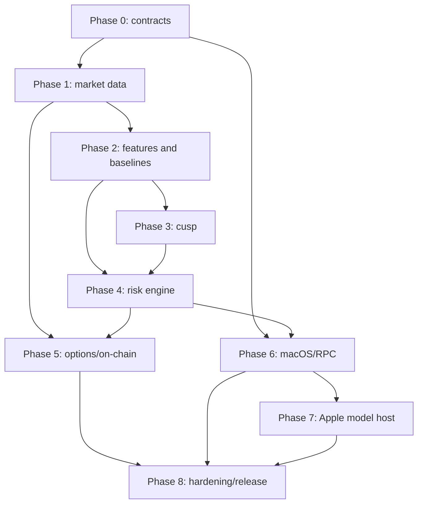

# Crypto Market Transition Intelligence Master Implementation Plan

> **For agentic workers:** REQUIRED SUB-SKILL: Use superpowers:subagent-driven-development (recommended) or superpowers:executing-plans to implement this plan task-by-task. Steps use checkbox (`- [ ]`) syntax for tracking.

**Goal:** Deliver the approved local-first crypto market-transition observatory as a sequence of independently testable Rust, Swift, scientific-validation, and release work packages.

**Architecture:** A single Rust daemon owns source ingestion, deterministic state, point-in-time features, statistical models, forecasts, replay, storage, and audit. A native SwiftUI macOS application communicates over an authenticated loopback gRPC contract and hosts optional on-device Apple model capabilities behind strict numerical-integrity boundaries.

**Tech Stack:** Rust 1.97.1/edition 2024, Tokio 1.51 LTS line, Tower, Tonic/Prost, Arrow/Parquet/DataFusion, bundled SQLite, Swift 6.3, SwiftUI, gRPC Swift 2, Core ML, capability-gated Core AI, Foundation Models, GitHub Actions, cargo-fuzz, proptest, Loom, Criterion, XCTest/Swift Testing.

## Global Constraints

- Rust production code uses Rust 1.97.1 initially, edition 2024, with MSRV 1.88; `Cargo.lock` is committed.
- Tokio stays on the tested 1.51 LTS minor line; Tonic stays on the tested 0.14 minor line.
- Swift code uses Swift 6.3 strict concurrency. The app baseline is Apple Silicon macOS 26; Core AI is optional and capability-gated on macOS 27 or later.
- SQLite is bundled at 3.53.3 or later; 3.51.3 is the absolute floor. SQLite stores metadata and audit state only, never high-rate books or trades.
- Source monetary values use checked `i128` fixed-point wrappers. `f64` begins only at an explicitly tested analytical boundary.
- One Rust modular-monolith daemon owns authoritative state and probabilities. Swift renders values received through versioned protobuf contracts and never recalculates production forecasts.
- Raw capture, replay, feature materialization, training, inference, and audit are local-first. Remote telemetry and hosted inference are disabled by default.
- No trading or withdrawal credentials, order placement, or automated execution are introduced in v1.
- Every bounded queue has a declared capacity and overflow policy. No order-book delta is silently dropped.
- Every production forecast is persisted with model, feature, label, quality, evidence, and calibration identifiers before alert delivery.
- Development follows test-driven increments, warnings-as-errors where practical, frequent focused commits, and deterministic fixtures.
- No task may weaken point-in-time correctness, abstention, source-quality gating, artifact signing, or audit lineage to make a demo pass.

---

## Program decomposition

The approved specification spans independent subsystems that require different reviewers, fixtures, and release evidence. Implementation is therefore divided into the following plans:

| Order | Plan | Primary result | Hard dependency |
|---:|---|---|---|
| 0 | `2026-07-24-phase-00-foundations-contracts.md` | Compiling repository, canonical contracts, local RPC security skeleton, CI | Approved specification |
| 1 | `2026-07-24-phase-01-market-data-foundation.md` | Certified venue capture, WAL, books, normalized storage, deterministic replay | Phase 0 |
| 2 | `2026-07-24-phase-02-features-labels-baselines.md` | Point-in-time features, labels, baseline research and model registry | Phases 0–1 |
| 3 | `2026-07-24-phase-03-stochastic-cusp.md` | Numerically robust cusp engine and evidence-gated structural features | Phase 2 |
| 4 | `2026-07-24-phase-04-risk-calibration-alerts.md` | Competing-risk forecasts, stacking, calibration, OOD, scenarios, alerts | Phases 2–3 |
| 5 | `2026-07-24-phase-05-options-onchain-coupling.md` | Options, Bitcoin/Ethereum, attribution, stablecoin and coupled-instability research | Phases 1–4 |
| 6 | `2026-07-24-phase-06-macos-rpc-product.md` | Production SwiftUI client, authenticated daemon lifecycle, primary workflows | Phases 0–4 |
| 7 | `2026-07-24-phase-07-local-apple-models.md` | Core ML/Core AI/Foundation Models host with deterministic fallbacks | Phase 6 |
| 8 | `2026-07-24-phase-08-hardening-shadow-release.md` | Fault tolerance, security, shadow gates, packaging, provenance, stable release | All prior phases |

## Dependency graph



## Branch and review model

- Create one protected integration branch from `main` only if repository policy requires it; otherwise use short-lived task branches.
- A task is merged only after its focused test, subsystem test, lint, and required fixture checks pass.
- Schema, event-label, model-promotion, security-boundary, and source-semantics changes require the matching domain owner.
- Connector tasks require fixture provenance and certification records.
- Numerical/model tasks require a before/after replay or evaluation artifact.
- Generated dependency updates never auto-merge into production branches.

## Cross-plan contracts frozen before parallel work

1. `fixed-decimal`, `domain`, and `event-envelope` public Rust types.
2. Protobuf package names, field-number policy, stream envelope, error codes, and handshake capability model.
3. Instrument-generation and source-completeness semantics.
4. WAL record framing and replay ordering.
5. Feature observation, as-known-at, finality, quality, and lineage fields.
6. Label definitions, censoring rules, horizons, and embargo calculation.
7. Model package manifest, registry transitions, and signature verification.
8. Forecast, evidence, scenario, alert, and abstention records.

Any incompatible change to these contracts requires an ADR, migration test, and explicit downstream plan update.

## Program-wide verification commands

```bash
cargo fmt --all -- --check
cargo clippy --workspace --all-targets --all-features -- -D warnings
cargo test --workspace --all-features
for manifest in fixtures/golden-replays/*/manifest.toml; do cargo run -p crypto-replay -- --manifest "$manifest" --verify; done
cargo run -p xtask -- proto-check
cargo run -p xtask -- license-check
cargo run -p xtask -- spec-traceability
swift test --package-path apps/macos/Packages/TransitionClient
xcodebuild test -project apps/macos/CuspObservatory.xcodeproj -scheme CuspObservatory -destination 'platform=macOS'
```

## Program exit condition

The program is complete only when the production acceptance checklist in sections 37.1–37.7 of the approved specification is machine-linked to passing CI evidence, model cards, signed artifacts, replay hashes, notarized application artifacts, and an independently reviewable release manifest.

## Execution discipline

Implement one plan at a time unless two tasks consume only already-frozen contracts and have no shared files. Use a clean worktree for execution. After each plan, run its exit gate and update `docs/implementation/traceability.md` with immutable evidence links before beginning dependent work.
